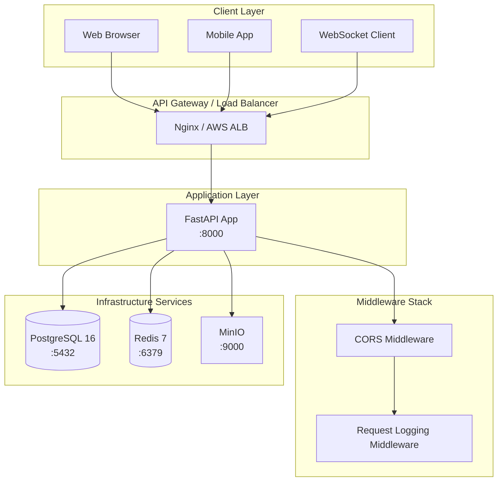
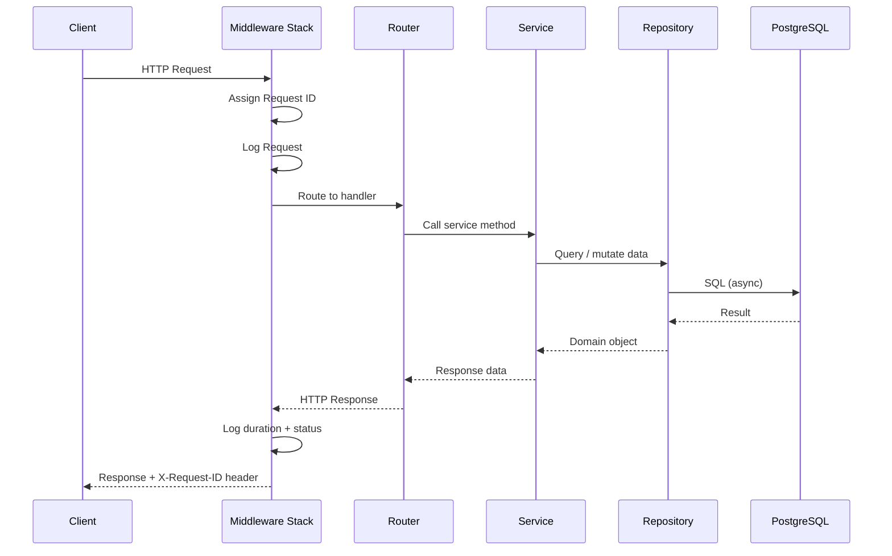
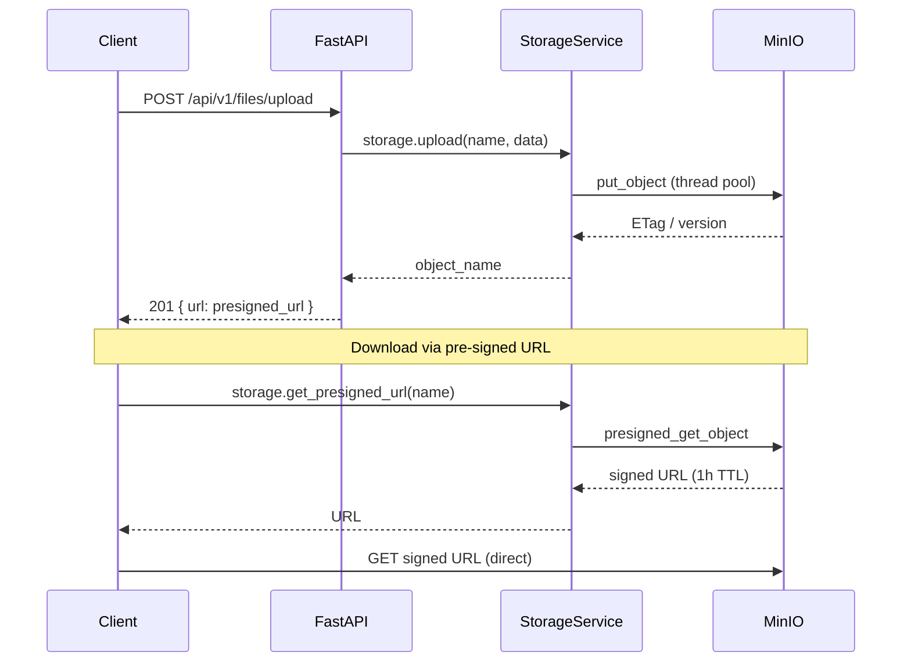
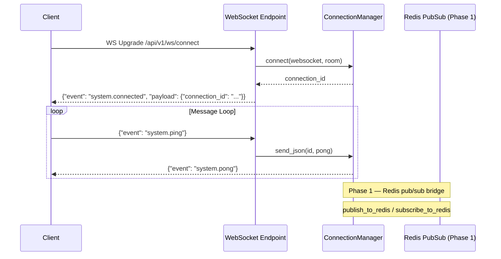

# SIMS Lite Backend — Architecture

## Overview

SIMS Lite Backend is a modular, async-first FastAPI application designed for
school information management. Phase 0 establishes the infrastructure foundation;
business modules are added in subsequent phases.

---

## High-Level Architecture



---

## Request Lifecycle



---

## Package Structure

```
app/
├── main.py                 # Application factory + lifespan
├── core/
│   ├── config.py           # Pydantic Settings (all env vars)
│   ├── logging.py          # Structured logging (structlog)
│   ├── exceptions.py       # Exception hierarchy + global handlers
│   ├── security.py         # JWT + password helpers (Phase 1 scaffold)
│   └── redis.py            # Redis client lifecycle
├── api/
│   └── v1/
│       ├── router.py       # Assembles all v1 endpoint routers
│       └── endpoints/
│           ├── health.py   # GET /api/v1/health
│           ├── system.py   # GET /api/v1/system/health
│           └── websocket.py
├── database/
│   ├── base.py             # DeclarativeBase + TimestampMixin + UUIDMixin
│   ├── engine.py           # Async engine, session factory, get_db dep
│   └── health.py           # DB ping utility
├── models/                 # SQLAlchemy ORM models (Phase 1+)
├── schemas/
│   └── base.py             # SuccessResponse, PaginatedResponse, ErrorResponse
├── services/               # Business logic layer (Phase 1+)
├── repositories/
│   └── base.py             # Generic async CRUD repository
├── websockets/
│   ├── manager.py          # ConnectionManager singleton
│   └── events.py           # EventType enum + WebSocketEvent schema
├── storage/
│   └── minio_client.py     # StorageService (upload/delete/presign)
├── middleware/
│   └── logging.py          # RequestLoggingMiddleware
└── tasks/                  # Background task scaffold (Phase 1+)
```

---

## Data Flow — Object Storage



---

## WebSocket Event Flow



---

## Layers and Responsibilities

| Layer | Location | Responsibility |
|---|---|---|
| API | `app/api/` | HTTP routing, request parsing, response serialisation |
| Service | `app/services/` | Business logic, orchestration, validation |
| Repository | `app/repositories/` | All database queries |
| Model | `app/models/` | SQLAlchemy ORM table definitions |
| Schema | `app/schemas/` | Pydantic I/O contracts |
| Core | `app/core/` | Config, logging, exceptions, security, Redis |
| Storage | `app/storage/` | MinIO operations |
| WebSocket | `app/websockets/` | Real-time connection management |
| Middleware | `app/middleware/` | Cross-cutting concerns |
| Tasks | `app/tasks/` | Background / async jobs |

---

## Technology Stack

| Component | Technology | Version |
|---|---|---|
| Web framework | FastAPI | 0.111 |
| ASGI server | Uvicorn | 0.29 |
| ORM | SQLAlchemy | 2.0 (async) |
| DB driver | asyncpg | 0.29 |
| Migrations | Alembic | 1.13 |
| Database | PostgreSQL | 16 |
| Cache / Pub-Sub | Redis | 7 |
| Object storage | MinIO | latest |
| Validation | Pydantic | v2 |
| Logging | structlog | 24.2 |
| Containerisation | Docker Compose | v3.9 |
| Testing | pytest + pytest-asyncio | 8.2 / 0.23 |
