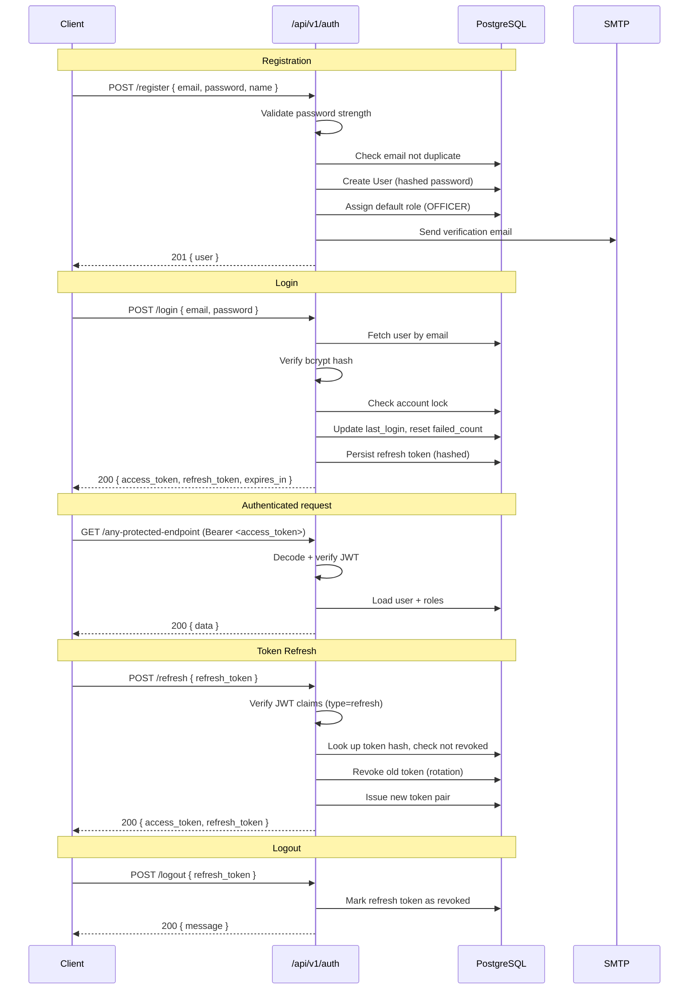
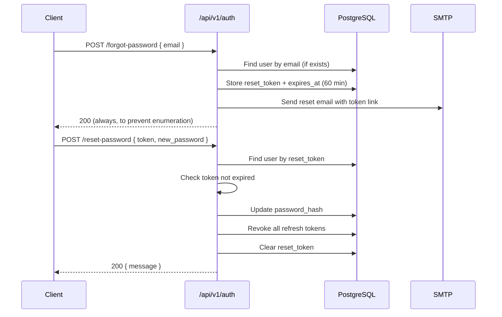

# Authentication — SIMS Lite Backend

## Overview

SIMS Lite uses **JWT Bearer token** authentication with refresh token rotation. Every protected endpoint expects an `Authorization: Bearer <access_token>` header.

---

## Authentication Flow



---

## Password Reset Flow



---

## Endpoints Reference

| Method | Path | Auth Required | Description |
|--------|------|---------------|-------------|
| POST | `/api/v1/auth/register` | No | Create account |
| POST | `/api/v1/auth/login` | No | Get tokens |
| POST | `/api/v1/auth/logout` | Yes | Revoke refresh token |
| POST | `/api/v1/auth/logout-all` | Yes | Revoke all tokens |
| POST | `/api/v1/auth/refresh` | No (token) | Rotate token pair |
| POST | `/api/v1/auth/forgot-password` | No | Request reset email |
| POST | `/api/v1/auth/reset-password` | No (token) | Set new password |
| POST | `/api/v1/auth/change-password` | Yes | Change own password |
| GET | `/api/v1/auth/verify-email` | No (token) | Verify email address |
| GET | `/api/v1/auth/me` | Yes | Get current user |

---

## Token Structure

### Access Token Claims

```json
{
  "sub": "<user_uuid>",
  "exp": 1234567890,
  "iat": 1234567890,
  "type": "access",
  "email": "user@example.com",
  "roles": ["ADMIN"],
  "is_superuser": false
}
```

- Default expiry: **30 minutes** (configurable via `JWT_ACCESS_TOKEN_EXPIRE_MINUTES`)
- Algorithm: **HS256**

### Refresh Token Claims

```json
{
  "sub": "<user_uuid>",
  "exp": 1234567890,
  "iat": 1234567890,
  "type": "refresh"
}
```

- Default expiry: **7 days** (configurable via `JWT_REFRESH_TOKEN_EXPIRE_DAYS`)
- Stored hashed (SHA-256) in `refresh_tokens` table

---

## Security Measures

### Brute-Force Protection

After **5 failed logins** the account is locked for **15 minutes**. The lock state is stored in `users.locked_until`.

### Refresh Token Rotation

Every time a refresh token is used, it is immediately revoked and a new pair is issued. Detecting re-use of a revoked token is an indicator of token theft.

### Password Policy

Passwords must contain:
- Minimum **8 characters**
- At least one **uppercase** letter
- At least one **lowercase** letter
- At least one **digit**
- At least one **special character** (`!@#$%^&*...`)

### Token Storage (Client Side)

- Store the **access token** in memory (not localStorage) to mitigate XSS attacks
- Store the **refresh token** in an `HttpOnly` cookie when possible

---

## Environment Variables

| Variable | Default | Description |
|----------|---------|-------------|
| `JWT_SECRET_KEY` | `change-me` | HMAC signing secret (must be random, 32+ chars) |
| `JWT_ALGORITHM` | `HS256` | JWT signing algorithm |
| `JWT_ACCESS_TOKEN_EXPIRE_MINUTES` | `30` | Access token TTL |
| `JWT_REFRESH_TOKEN_EXPIRE_DAYS` | `7` | Refresh token TTL |
| `SMTP_HOST` | — | SMTP server for password reset emails |
| `SMTP_PORT` | `587` | SMTP port |
| `SMTP_USER` | — | SMTP username |
| `SMTP_PASSWORD` | — | SMTP password |
| `SMTP_TLS` | `true` | Enable STARTTLS |
| `SMTP_FROM_EMAIL` | — | Sender address |
