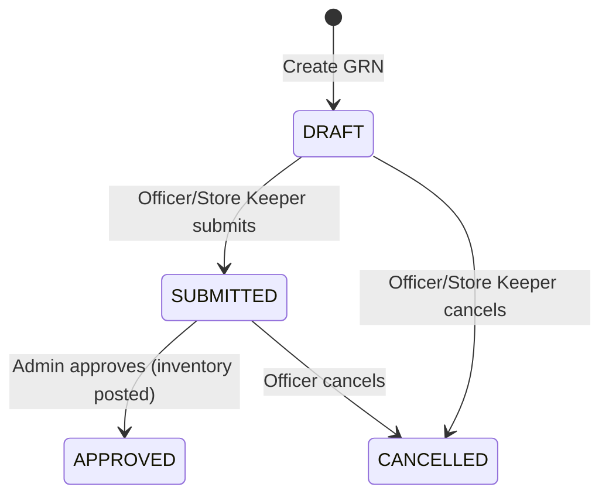
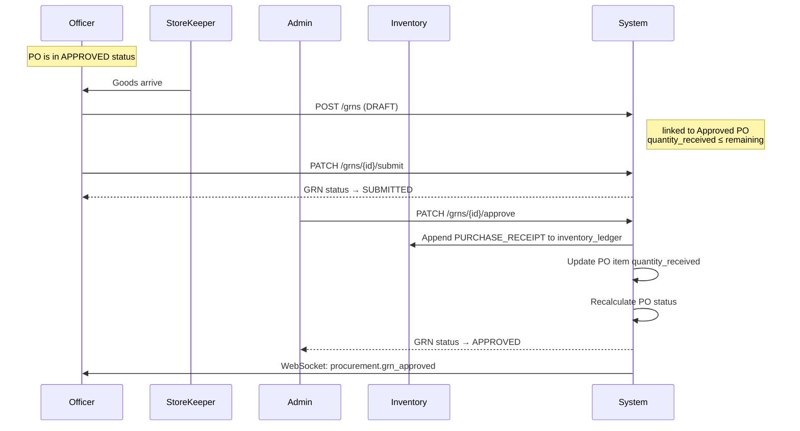

# GRN (Goods Received Note) Workflow

## Overview

A Goods Received Note records the physical receipt of goods from a supplier against an approved Purchase Order. GRN approval triggers automatic inventory posting and ledger recording.

## Status Lifecycle



## State Transition Rules

| From Status | Action  | To Status | Who                      | Effect                          |
|-------------|---------|-----------|--------------------------|----------------------------------|
| DRAFT       | Submit  | SUBMITTED | Officer / Store Keeper   | GRN must have at least one item  |
| DRAFT       | Cancel  | CANCELLED | Officer / Store Keeper   | —                                |
| SUBMITTED   | Approve | APPROVED  | Admin                    | Inventory posted, PO qty updated |
| SUBMITTED   | Cancel  | CANCELLED | Officer                  | —                                |
| APPROVED    | —       | —         | —                        | Cannot be cancelled              |

## Partial Delivery Support

Multiple GRNs can be created against a single PO to support partial deliveries. The system enforces that:

- You cannot receive more units than were ordered (cumulative across all GRNs)
- Each GRN item is linked to a specific PO item
- The PO status automatically transitions:
  - Any items received → `PARTIALLY_RECEIVED`
  - All items fully received → `FULLY_RECEIVED`

## Full Workflow Sequence



## Inventory Posting on GRN Approval

When an admin approves a GRN, for each GRN item:

```python
quantity_before = current_stock(product)       # latest ledger entry
quantity_change = grn_item.quantity_received
quantity_after  = quantity_before + quantity_change

inventory_ledger.append(
    product_id     = grn_item.product_id,
    entry_type     = "PURCHASE_RECEIPT",
    quantity_before = quantity_before,
    quantity_change = quantity_change,
    quantity_after  = quantity_after,
    unit_cost       = grn_item.unit_cost,
    grn_id          = grn.id,
    reference_number = grn.grn_number,
)
```

The ledger is **immutable** — entries are never updated or deleted. Stock level is always derived from the most recent `quantity_after` value for a product.

## Quantity Validation

When creating or updating a GRN, the system validates:

```
remaining = po_item.quantity_ordered - po_item.quantity_received
if grn_item.quantity_received > remaining:
    raise ValidationError("Cannot receive more than remaining quantity")
```

This prevents over-receiving and maintains data integrity across partial deliveries.

## Business Rules Summary

1. GRNs can only be created for **APPROVED** or **PARTIALLY_RECEIVED** POs.
2. Each GRN item must reference a valid PO item from the linked PO.
3. The product on a GRN item must match the product on the referenced PO item.
4. Total received per PO item (across all GRNs) cannot exceed ordered quantity.
5. Inventory is only updated when a GRN is **approved** — not on create or submit.
6. An **APPROVED** GRN cannot be cancelled.
