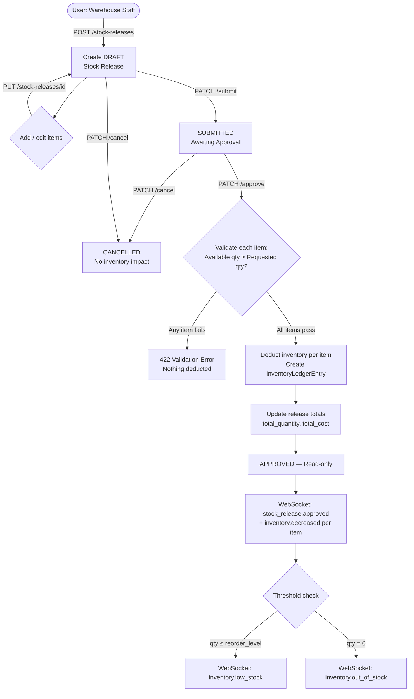
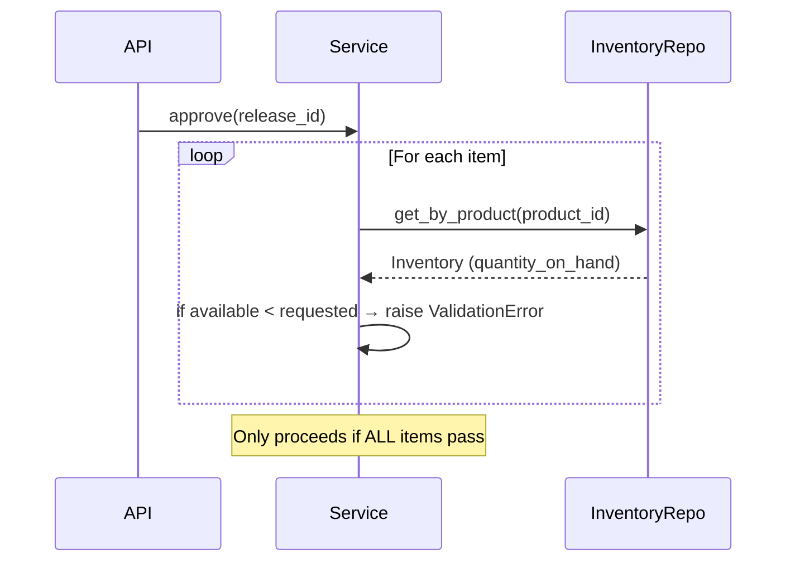
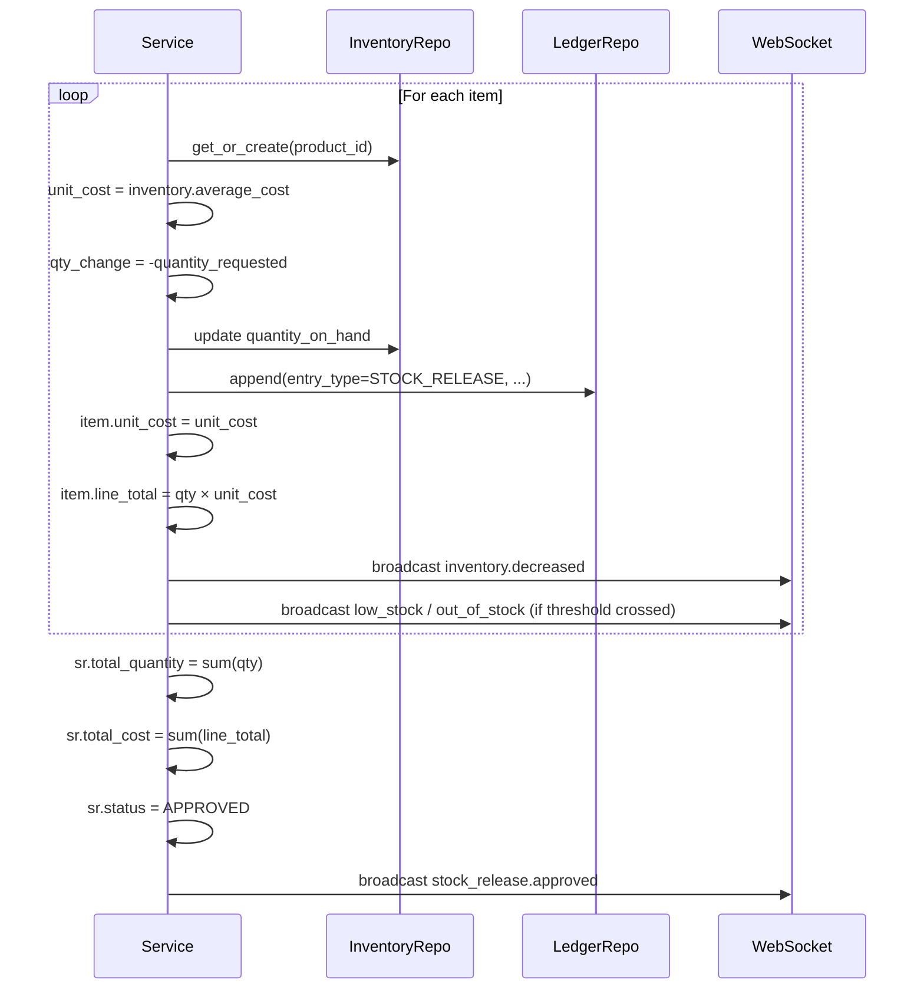

# Inventory Issue Workflow

This document describes the complete end-to-end workflow for issuing (releasing) inventory items from the warehouse — from document creation through to the immutable ledger entry.

---

## High-Level Flow



---

## Step-by-Step

### 1. Create a DRAFT Release

```http
POST /api/v1/stock-releases/
Authorization: Bearer <token>

{
  "purpose": "MAINTENANCE",
  "release_date": "2026-07-23T08:00:00Z",
  "reference_document": "WO-2026-0101",
  "items": [
    { "product_id": "uuid-a", "quantity_requested": 2.0 },
    { "product_id": "uuid-b", "quantity_requested": 5.0 }
  ]
}
```

- A release number is auto-generated: `SR-YYYYMMDD-NNNNN`
- `unit_cost` and `line_total` on items are **0** at this stage
- `total_quantity` and `total_cost` on the header are **0**
- Status: **DRAFT**

### 2. Edit (Optional)

While in DRAFT status, the document can be modified or deleted:

```http
PUT /api/v1/stock-releases/{id}
```

### 3. Submit

```http
PATCH /api/v1/stock-releases/{id}/submit
```

- Must have at least one item
- Status transitions: **DRAFT → SUBMITTED**
- WebSocket event: `stock_release.submitted`

### 4. Approve

```http
PATCH /api/v1/stock-releases/{id}/approve
```

This is the critical step. The service performs the following atomically:

#### Pre-validation (all items checked before any deduction)



If **any** item fails the check, the entire approval is rejected with HTTP 422 and no changes are made.

#### Inventory deduction (per item)



### 5. Cancel (Alternative Path)

```http
PATCH /api/v1/stock-releases/{id}/cancel
{ "reason": "Work order postponed" }
```

- Can be cancelled from **DRAFT** or **SUBMITTED** only
- **No inventory impact whatsoever**
- WebSocket event: `stock_release.cancelled`

---

## Inventory Ledger

Every approved item generates one `InventoryLedgerEntry`:

```
quantity_before  +  quantity_change  =  quantity_after
    100.0        +     -5.0          =      95.0
```

Ledger entries are **immutable** — they are never updated or deleted.

Example ledger entry for a stock release:

| Field | Value |
|-------|-------|
| `entry_type` | `STOCK_RELEASE` |
| `reference_type` | `STOCK_RELEASE` |
| `reference_id` | `uuid of the StockRelease` |
| `reference_number` | `SR-20260723-00001` |
| `quantity_before` | `100.0` |
| `quantity_change` | `-5.0` |
| `quantity_after` | `95.0` |
| `unit_cost` | `12.50` (WAC at approval time) |

Query all ledger entries for a specific release:

```http
GET /api/v1/inventory-ledger/reference/STOCK_RELEASE/{release_id}
```

---

## Cost Valuation

The **weighted average cost (WAC)** method is used throughout SIMS Lite:

- On **GRN approval** (Phase 3): WAC is updated upward when new stock arrives.
- On **stock release approval** (Phase 5): The **current WAC** is captured onto the release item's `unit_cost`. The WAC on the `inventory` row itself is **not recalculated** on outbound movements (only updated on inbound).

---

## Negative Stock Prevention

The service performs a **two-phase check**:

1. **Pre-validation** — all items in the release are checked against live inventory before any deduction begins.
2. **`_apply_inventory_change`** — the shared helper also enforces `qty_after >= 0` as a final safety net.

If either check fails, a `ValidationError` (HTTP 422) is raised and no inventory is changed.

---

## Notifications Reference

All events use the envelope format:

```json
{
  "event": "stock_release.approved",
  "payload": {
    "id": "uuid",
    "release_number": "SR-20260723-00001",
    "approved_by": "Jane Smith",
    "total_quantity": 15.0,
    "total_cost": 187.50
  },
  "room": null,
  "sender": null
}
```

| Event | Trigger |
|-------|---------|
| `stock_release.created` | DRAFT created |
| `stock_release.submitted` | Submit transition |
| `stock_release.approved` | Approve transition |
| `stock_release.cancelled` | Cancel transition |
| `inventory.decreased` | Each item deducted on approval |
| `inventory.low_stock` | After deduction, if qty ≤ reorder_level |
| `inventory.out_of_stock` | After deduction, if qty = 0 |

---

## Permissions

| Action | Required Permission |
|--------|-------------------|
| View / list | `inventory:read` |
| Create / edit / delete / submit / cancel | `inventory:write` |
| Approve | `inventory:approve` |
| Export reports | `reports:export` |
