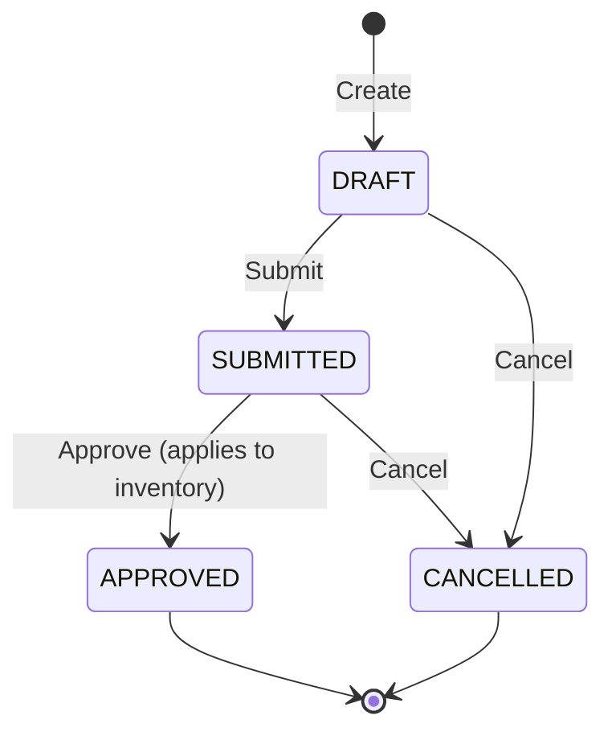

# Inventory Management

SIMS Lite Phase 4 introduces a single-store inventory engine that tracks stock levels, costs, and movements for every product. All changes to inventory are recorded as immutable ledger entries, providing a complete audit trail from opening balance through every receipt, adjustment, and release.

## Overview

Key principles driving the inventory engine:

- **Single location** — one inventory row per product; no warehouse/bin tracking
- **Increases from GRNs** — stock is added only when a GRN is approved
- **Decreases from Stock Releases** — stock is removed only when a Stock Release is approved
- **Corrections via Stock Adjustments** — manual corrections (physical counts, damage, shrinkage) go through the adjustment workflow
- **Immutable ledger** — every inventory change writes an `inventory_ledger_entries` row that is never updated or deleted

## Database Tables

| Table Name | Purpose | Key Fields |
|---|---|---|
| `inventory` | Current stock snapshot per product | `product_id` (unique), `quantity_on_hand`, `average_cost` |
| `inventory_ledger_entries` | Immutable movement log | `product_id`, `entry_type`, `quantity_before`, `quantity_change`, `quantity_after`, `unit_cost`, `reference_type`, `reference_id` |
| `stock_adjustments` | Adjustment header | `adjustment_number`, `adjustment_type`, `status`, `reason` |
| `stock_adjustment_items` | Adjustment line items | `stock_adjustment_id`, `product_id`, `quantity_adjusted`, `unit_cost` |

## Inventory Rules

1. `quantity_on_hand` is always the latest `quantity_after` from the ledger for that product.
2. Stock can never go below zero — attempting a decrease that would result in negative stock raises a validation error.
3. Every change to `inventory` must be accompanied by a new `inventory_ledger_entries` row.
4. Ledger rows are immutable — they are never updated or deleted after creation.
5. Weighted average cost is recalculated on every stock increase using the formula: `new_avg = (old_qty × old_avg + new_qty × unit_cost) / (old_qty + new_qty)`.

## Inventory Entry Types

| Entry Type | Description | Triggered By |
|---|---|---|
| `PURCHASE_RECEIPT` | Stock increase from GRN | Approved GRN |
| `ADJUSTMENT_IN` | Positive stock correction | Approved INCREASE adjustment |
| `ADJUSTMENT_OUT` | Negative stock correction | Approved DECREASE/RECOUNT adjustment |
| `STOCK_RELEASE` | Stock decrease from release | Approved Stock Release |
| `INITIAL_STOCK` | Opening balance | Initial setup |

## API Reference

### Inventory APIs

| Method | Path | Permission | Description |
|---|---|---|---|
| `GET` | `/api/v1/inventory/` | `inventory:read` | Paginated list of current stock for all products |
| `GET` | `/api/v1/inventory/summary` | `inventory:read` | Aggregate summary (counts, totals) |
| `GET` | `/api/v1/inventory/value` | `inventory:read` | Full inventory valuation by product |
| `GET` | `/api/v1/inventory/low-stock` | `inventory:read` | Products at or below reorder level |
| `GET` | `/api/v1/inventory/out-of-stock` | `inventory:read` | Products with zero stock |
| `GET` | `/api/v1/inventory/{product_id}` | `inventory:read` | Current stock for a specific product |

### Stock Adjustment APIs

| Method | Path | Permission | Description |
|---|---|---|---|
| `GET` | `/api/v1/stock-adjustments/` | `inventory:read` | Paginated list of adjustments |
| `POST` | `/api/v1/stock-adjustments/` | `inventory:write` | Create a new DRAFT adjustment |
| `GET` | `/api/v1/stock-adjustments/{id}` | `inventory:read` | Get a single adjustment |
| `PUT` | `/api/v1/stock-adjustments/{id}` | `inventory:write` | Update a DRAFT adjustment |
| `DELETE` | `/api/v1/stock-adjustments/{id}` | `inventory:write` | Soft-delete a DRAFT adjustment |
| `PATCH` | `/api/v1/stock-adjustments/{id}/submit` | `inventory:write` | Submit for approval |
| `PATCH` | `/api/v1/stock-adjustments/{id}/approve` | `inventory:write` | Approve and apply to inventory |
| `PATCH` | `/api/v1/stock-adjustments/{id}/cancel` | `inventory:write` | Cancel an adjustment |

### Inventory Ledger APIs

| Method | Path | Permission | Description |
|---|---|---|---|
| `GET` | `/api/v1/inventory-ledger/` | `inventory:read` | Paginated ledger with optional filters |
| `GET` | `/api/v1/inventory-ledger/{id}` | `inventory:read` | Single ledger entry by ID |
| `GET` | `/api/v1/inventory-ledger/product/{product_id}` | `inventory:read` | Ledger history for a specific product |
| `GET` | `/api/v1/inventory-ledger/reference/{ref_type}/{ref_id}` | `inventory:read` | All ledger entries for a reference document |

### Dashboard

`GET /api/v1/dashboard/inventory` — Returns an `InventoryDashboard` object containing KPIs: total products, in-stock count, out-of-stock count, low-stock count, total quantity on hand, total stock value, pending adjustments count, and the 10 most recent inventory movements.

### Reports

| Method | Path | Description |
|---|---|---|
| `GET` | `/api/v1/inventory-reports/stock-snapshot` | Current stock snapshot report |
| `GET` | `/api/v1/inventory-reports/ledger` | Full ledger movement report |
| `GET` | `/api/v1/inventory-reports/adjustments` | Stock adjustment summary report |
| `GET` | `/api/v1/inventory-reports/valuation` | Inventory valuation report |

## Stock Adjustment Workflow



## Inventory Valuation

SIMS Lite uses the **weighted average cost** method to value inventory. Every time stock is received (via a GRN or an INCREASE adjustment), the average cost is recalculated:

```
new_average_cost = (current_qty × current_avg_cost + received_qty × unit_cost)
                   ÷ (current_qty + received_qty)
```

The resulting `average_cost` on the `inventory` row is used for all stock value calculations. Decreases do not change the average cost — they only reduce `quantity_on_hand`.

## Low Stock Monitoring

A product is considered **low stock** when:

```
quantity_on_hand > 0  AND  quantity_on_hand <= reorder_level
```

A product is considered **out of stock** when `quantity_on_hand <= 0`.

The `reorder_level` is set on the `products` table. If `reorder_level` is 0 the product is excluded from low-stock alerts.

## WebSocket Events

Real-time events are broadcast over the WebSocket connection at `ws://host/api/v1/ws` whenever inventory changes occur.

| Event | Trigger |
|---|---|
| `inventory.increased` | GRN approved or INCREASE adjustment approved |
| `inventory.decreased` | DECREASE adjustment approved |
| `inventory.low_stock` | Stock drops to or below reorder level |
| `inventory.out_of_stock` | Stock reaches zero |
| `inventory.adjustment_created` | New adjustment created |
| `inventory.adjustment_submitted` | Adjustment submitted for approval |
| `inventory.adjustment_approved` | Adjustment approved and applied |
| `inventory.adjustment_cancelled` | Adjustment cancelled |
