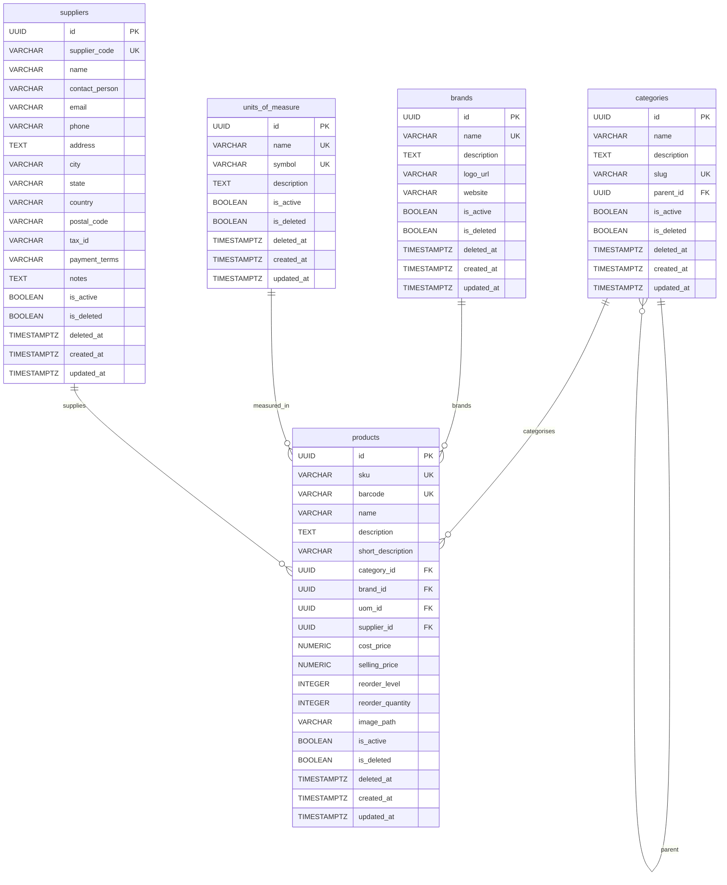

# Master Data Management

## Overview

Phase 2 introduces the Master Data Management module for SIMS Lite. This module provides the foundational business entities required by all procurement and inventory operations: categories, brands, units of measure, suppliers, and products.

All entities use UUID primary keys, audit timestamps, and soft deletes (records are marked `is_deleted=true` rather than permanently removed).

---

## ER Diagram



---

## Module Architecture

```
app/
  models/master_data.py          ORM models (Category, Brand, UnitOfMeasure, Supplier, Product)
  repositories/master_data.py    Data access layer with paginated queries
  schemas/master_data.py         Pydantic v2 request/response schemas
  services/master_data.py        Business logic (SKU/barcode generation, image handling)
  services/report.py             Excel report generation (openpyxl)
  api/v1/endpoints/
    categories.py
    brands.py
    uoms.py
    suppliers.py
    products.py
    reports.py
```

---

## Database Tables

### `categories`

Hierarchical product categories with optional single-level parent reference.

| Column | Type | Notes |
|---|---|---|
| `id` | UUID | Primary key |
| `name` | VARCHAR(100) | Unique within the same parent |
| `slug` | VARCHAR(120) | URL-friendly identifier, globally unique |
| `description` | TEXT | Optional |
| `parent_id` | UUID | Self-referential FK, `SET NULL` on delete |
| `is_active` | BOOLEAN | Soft enable/disable |
| `is_deleted` | BOOLEAN | Soft delete flag |
| `deleted_at` | TIMESTAMPTZ | Set when soft-deleted |

### `brands`

Product brand or manufacturer registry.

| Column | Type | Notes |
|---|---|---|
| `id` | UUID | Primary key |
| `name` | VARCHAR(100) | Globally unique |
| `description` | TEXT | Optional |
| `logo_url` | VARCHAR(500) | MinIO path or external URL |
| `website` | VARCHAR(255) | Optional |
| `is_active` | BOOLEAN | |
| `is_deleted` | BOOLEAN | |

### `units_of_measure`

Measurement units used on product records and purchase orders.

| Column | Type | Notes |
|---|---|---|
| `id` | UUID | Primary key |
| `name` | VARCHAR(100) | Unique (e.g. "Kilogram") |
| `symbol` | VARCHAR(20) | Unique short form (e.g. "kg") |
| `description` | TEXT | Optional |

### `suppliers`

Vendor directory used in procurement and product cataloguing.

| Column | Type | Notes |
|---|---|---|
| `id` | UUID | Primary key |
| `supplier_code` | VARCHAR(30) | Auto-generated `SUP-XXXXX` if not provided |
| `name` | VARCHAR(200) | Required |
| `contact_person` | VARCHAR(100) | Optional |
| `email` | VARCHAR(255) | Optional |
| `phone` | VARCHAR(30) | Optional |
| `address` | TEXT | Optional |
| `city / state / country` | VARCHAR(100) | Optional |
| `tax_id` | VARCHAR(50) | Optional |
| `payment_terms` | VARCHAR(100) | Optional |

### `products`

Core product catalogue.

| Column | Type | Notes |
|---|---|---|
| `id` | UUID | Primary key |
| `sku` | VARCHAR(50) | Auto-generated, unique |
| `barcode` | VARCHAR(50) | Auto-generated Code128 numeric value, unique |
| `name` | VARCHAR(200) | Required |
| `category_id` | UUID | FK → categories |
| `brand_id` | UUID | FK → brands |
| `uom_id` | UUID | FK → units_of_measure |
| `supplier_id` | UUID | FK → suppliers |
| `cost_price` | NUMERIC(12,4) | Optional |
| `selling_price` | NUMERIC(12,4) | Optional |
| `reorder_level` | INTEGER | Minimum stock before reorder alert |
| `reorder_quantity` | INTEGER | Default order quantity |
| `image_path` | VARCHAR(500) | MinIO object path |

---

## API Endpoints

### Categories

| Method | URL | Auth | Description |
|---|---|---|---|
| GET | `/api/v1/categories/` | Authenticated | List (paginated, search, filter) |
| POST | `/api/v1/categories/` | `master_data:write` | Create category |
| GET | `/api/v1/categories/{id}` | Authenticated | Get by ID |
| PUT | `/api/v1/categories/{id}` | `master_data:write` | Update |
| DELETE | `/api/v1/categories/{id}` | `master_data:delete` | Soft delete |

### Brands

| Method | URL | Auth | Description |
|---|---|---|---|
| GET | `/api/v1/brands/` | Authenticated | List |
| POST | `/api/v1/brands/` | `master_data:write` | Create |
| GET | `/api/v1/brands/{id}` | Authenticated | Get by ID |
| PUT | `/api/v1/brands/{id}` | `master_data:write` | Update |
| DELETE | `/api/v1/brands/{id}` | `master_data:delete` | Soft delete |

### Units of Measure

| Method | URL | Auth | Description |
|---|---|---|---|
| GET | `/api/v1/uoms/` | Authenticated | List |
| POST | `/api/v1/uoms/` | `master_data:write` | Create |
| GET | `/api/v1/uoms/{id}` | Authenticated | Get by ID |
| PUT | `/api/v1/uoms/{id}` | `master_data:write` | Update |
| DELETE | `/api/v1/uoms/{id}` | `master_data:delete` | Soft delete |

### Suppliers

| Method | URL | Auth | Description |
|---|---|---|---|
| GET | `/api/v1/suppliers/` | Authenticated | List |
| POST | `/api/v1/suppliers/` | `master_data:write` | Create |
| GET | `/api/v1/suppliers/{id}` | Authenticated | Get by ID |
| PUT | `/api/v1/suppliers/{id}` | `master_data:write` | Update |
| DELETE | `/api/v1/suppliers/{id}` | `master_data:delete` | Soft delete |

### Reports

| Method | URL | Auth | Description |
|---|---|---|---|
| GET | `/api/v1/reports/products` | `reports:export` | Excel product report |
| GET | `/api/v1/reports/suppliers` | `reports:export` | Excel supplier report |
| GET | `/api/v1/reports/categories` | `reports:export` | Excel category report |

---

## Permissions

Three new permissions are added in Phase 2:

| Permission | Assigned To |
|---|---|
| `master_data:read` | ADMIN, OFFICER, STORE_KEEPER |
| `master_data:write` | ADMIN, OFFICER |
| `master_data:delete` | ADMIN |

---

## Soft Delete Behaviour

All master data entities support soft delete. A `DELETE` request sets:
- `is_deleted = true`
- `is_active = false`
- `deleted_at = now()`

Soft-deleted records are excluded from all list, get, and FK validation queries. They remain in the database for audit and referential integrity purposes.
