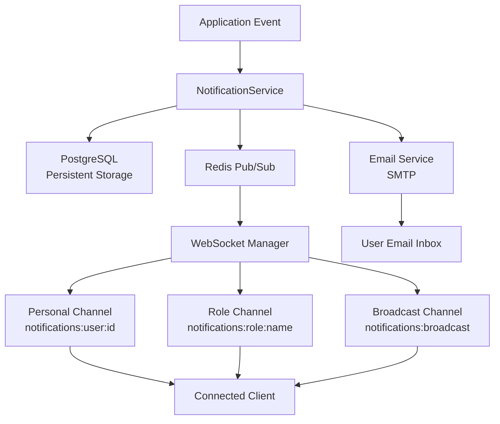

# Notification System — Phase 6A

SIMS Lite implements a production-ready, real-time notification system using **Redis Pub/Sub**, **WebSockets**, and **PostgreSQL** for persistent storage.

---

## Architecture Overview



---

## Notification Types

| Type | Description |
|------|-------------|
| `SYSTEM` | Platform system messages |
| `SUCCESS` | Successful operation confirmations |
| `INFO` | General informational messages |
| `WARNING` | Non-critical warnings |
| `ERROR` | Error conditions |
| `PURCHASE_ORDER` | PO lifecycle events |
| `GRN` | Goods Receipt Note events |
| `STOCK_RELEASE` | Stock release lifecycle events |
| `INVENTORY` | Inventory changes |
| `LOW_STOCK` | Stock below reorder level |
| `OUT_OF_STOCK` | Stock depleted to zero |
| `USER` | User management events |
| `SECURITY` | Authentication and security events |

---

## Priority Levels

| Priority | Description |
|----------|-------------|
| `LOW` | Background information |
| `NORMAL` | Standard notifications |
| `HIGH` | Requires prompt attention |
| `CRITICAL` | Immediate action required |

---

## Recipient Types

| Type | Description |
|------|-------------|
| `USER` | Single specific user (by `recipient_user_id`) |
| `ROLE` | All users with a specific role (by `recipient_role`) |
| `BROADCAST` | All users in the system |

---

## Database Schema

### `notifications`

| Column | Type | Description |
|--------|------|-------------|
| `id` | UUID PK | Unique identifier |
| `title` | VARCHAR(255) | Notification title |
| `message` | TEXT | Full notification message |
| `type` | VARCHAR(30) | `NotificationType` enum |
| `priority` | VARCHAR(20) | `NotificationPriority` enum |
| `recipient_type` | VARCHAR(20) | `RecipientType` enum |
| `recipient_role` | VARCHAR(50) | Role name (when type = ROLE) |
| `recipient_user_id` | UUID FK → users | Target user (when type = USER) |
| `sender_id` | UUID FK → users | Sender (admin or system) |
| `is_read` | BOOLEAN | Read state |
| `read_at` | TIMESTAMPTZ | When it was marked read |
| `data` | JSONB | Optional structured metadata |
| `created_at` | TIMESTAMPTZ | Creation timestamp |
| `updated_at` | TIMESTAMPTZ | Last update timestamp |

### `notification_preferences`

| Column | Type | Description |
|--------|------|-------------|
| `user_id` | UUID PK FK → users | User reference |
| `enable_websocket` | BOOLEAN | Receive via WebSocket (default: true) |
| `enable_email` | BOOLEAN | Receive via email (default: true) |
| `enable_system` | BOOLEAN | Receive system notifications (default: true) |
| `mute_until` | TIMESTAMPTZ | Silence notifications until this time |
| `created_at` | TIMESTAMPTZ | Creation timestamp |
| `updated_at` | TIMESTAMPTZ | Last update timestamp |

---

## API Reference

### Notification Endpoints

| Method | Path | Description |
|--------|------|-------------|
| `GET` | `/api/v1/notifications` | List all notifications (paginated) |
| `GET` | `/api/v1/notifications/unread` | List unread notifications (paginated) |
| `GET` | `/api/v1/notifications/{id}` | Get single notification |
| `PATCH` | `/api/v1/notifications/{id}/read` | Mark as read |
| `PATCH` | `/api/v1/notifications/read-all` | Mark all as read |
| `DELETE` | `/api/v1/notifications/{id}` | Delete notification |

### Notification Preferences

| Method | Path | Description |
|--------|------|-------------|
| `GET` | `/api/v1/notifications/preferences/me` | Get my preferences |
| `PUT` | `/api/v1/notifications/preferences/me` | Update my preferences |

### Dashboard Widgets

| Method | Path | Description |
|--------|------|-------------|
| `GET` | `/api/v1/notifications/dashboard/unread-count` | Unread count (+ critical/high breakdown) |
| `GET` | `/api/v1/notifications/dashboard/recent` | Recent notifications |
| `GET` | `/api/v1/notifications/dashboard/critical-alerts` | Critical & high priority unread |

### Admin

| Method | Path | Description |
|--------|------|-------------|
| `POST` | `/api/v1/admin/notifications/send` | Send targeted / broadcast notification |

#### Admin Send Request Body

```json
{
  "title": "System Maintenance",
  "message": "The system will be down for maintenance tonight at 11PM.",
  "type": "SYSTEM",
  "priority": "HIGH",
  "broadcast_all": true
}
```

Exactly one targeting field must be provided:
- `recipient_user_id` — specific user UUID
- `recipient_role` — role name string (`ADMIN`, `OFFICER`, `STORE_KEEPER`, etc.)
- `broadcast_all: true` — send to everyone

---

## Automatic Notifications

The `NotificationEventService` generates notifications automatically from business events:

### Authentication Events

| Trigger | Recipients | Type | Priority |
|---------|-----------|------|----------|
| User registered | ADMIN role | USER | NORMAL |
| Password reset | The user | SECURITY | HIGH |
| Login failure | The user | SECURITY | HIGH |

### Purchase Order Events

| Trigger | Recipients | Type | Priority |
|---------|-----------|------|----------|
| PO created | ADMIN role | PURCHASE_ORDER | NORMAL |
| PO submitted | ADMIN role | PURCHASE_ORDER | HIGH |
| PO approved | Requesting user | PURCHASE_ORDER | NORMAL |
| PO rejected | Requesting user | PURCHASE_ORDER | HIGH |
| PO cancelled | Requesting user | PURCHASE_ORDER | NORMAL |

### GRN Events

| Trigger | Recipients | Type | Priority |
|---------|-----------|------|----------|
| GRN created | ADMIN role | GRN | NORMAL |
| GRN approved | STORE_KEEPER role | GRN | NORMAL |
| GRN cancelled | ADMIN role | GRN | NORMAL |

### Inventory Events

| Trigger | Recipients | Type | Priority |
|---------|-----------|------|----------|
| Low stock | STORE_KEEPER role | LOW_STOCK | HIGH |
| Out of stock | STORE_KEEPER role | OUT_OF_STOCK | CRITICAL |

### Stock Release Events

| Trigger | Recipients | Type | Priority |
|---------|-----------|------|----------|
| Release created | ADMIN role | STOCK_RELEASE | NORMAL |
| Release submitted | ADMIN role | STOCK_RELEASE | HIGH |
| Release approved | Requesting user | STOCK_RELEASE | NORMAL |
| Release cancelled | Requesting user | STOCK_RELEASE | NORMAL |

---

## Notification Preferences

Users control their delivery preferences:

```json
{
  "enable_websocket": true,
  "enable_email": false,
  "enable_system": true,
  "mute_until": "2026-07-25T09:00:00Z"
}
```

Setting `mute_until` silences email delivery (WebSocket delivery continues).

---

## Email Integration

When `enable_email` is `true` for the recipient and the notification is user-specific, an HTML email is sent via the existing SMTP service with:
- Notification title as subject
- Full message in the email body
- Type and priority labels

---

## Dashboard Widgets

### Unread Count Widget

```json
{
  "status": "success",
  "data": {
    "unread_count": 12,
    "critical_count": 2,
    "high_count": 3
  }
}
```

### Recent Notifications Widget

```json
{
  "status": "success",
  "data": {
    "notifications": [...],
    "unread_count": 12
  }
}
```

### Critical Alerts Widget

```json
{
  "status": "success",
  "data": {
    "alerts": [...],
    "total": 2
  }
}
```
