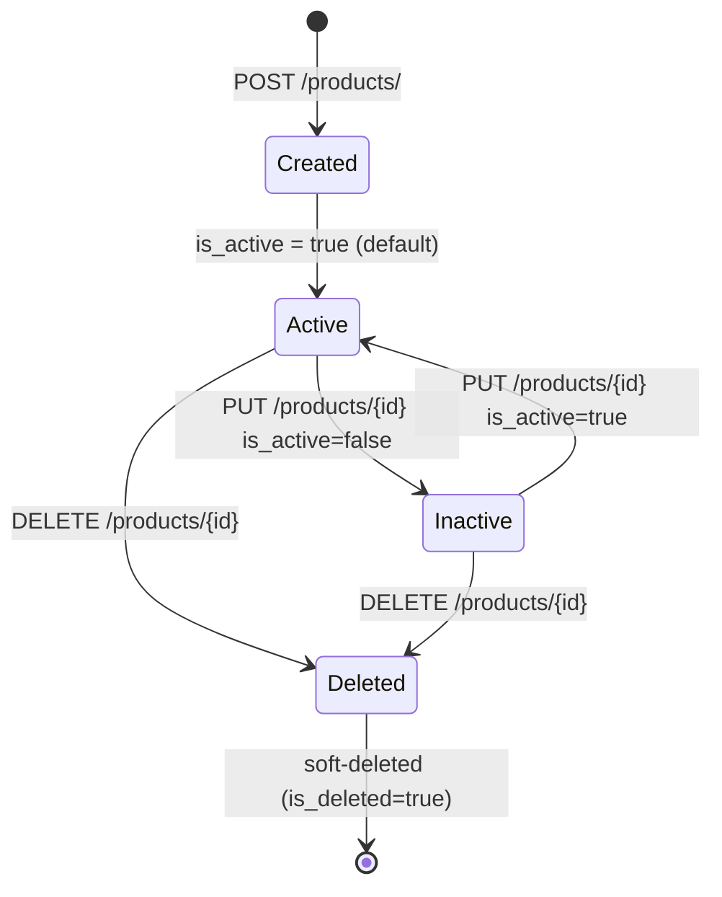

# Product Management

## Overview

Product management is the centrepiece of Phase 2. Each product record in SIMS Lite ties together category, brand, unit of measure, and supplier into a single catalogue entry with auto-generated SKU and Code128 barcode.

---

## Lifecycle



---

## SKU Generation

SKUs are automatically generated at creation time. Manual SKU assignment is not supported; the system guarantees uniqueness.

**Format:** `{PREFIX}-{YYYYMMDD}-{SEQUENCE}`

| Part | Description | Example |
|---|---|---|
| `PREFIX` | First 3 uppercase letters of the category name, or `GEN` if no category | `ELE`, `COM`, `GEN` |
| `YYYYMMDD` | Creation date in UTC | `20260723` |
| `SEQUENCE` | 5-digit zero-padded sequence count within the prefix+date combination | `00001` |

**Examples:**
- `ELE-20260723-00001` — first Electronics product on 23 Jul 2026
- `GEN-20260723-00042` — 42nd uncategorised product on the same day
- `COM-20260724-00003` — third Computers product on 24 Jul 2026

Duplicate SKUs are prevented at the database level (unique index) and in the service layer (retry loop with incremented sequence).

---

## Barcode Generation

Each product receives a 12-digit numeric barcode value at creation. The value is derived from a combination of the current timestamp milliseconds and an MD5 hash of the SKU, ensuring uniqueness across concurrent inserts.

- Format: 12-digit zero-padded numeric string
- Barcode standard: **Code128** (rendered via `python-barcode`)
- PNG rendering is available via `GET /api/v1/products/{id}/barcode`

**Barcode PNG endpoint response headers:**
```
Content-Type: image/png
X-Barcode-Value: 123456789012
X-Product-SKU: ELE-20260723-00001
```

---

## Product Image Management

Product images are stored in **MinIO** in the `sims-files` bucket under the path:

```
products/{product_id}/{uuid}.{ext}
```

Supported formats: `image/jpeg`, `image/png`, `image/webp`  
Maximum size: **5 MB**

### Upload image
```http
POST /api/v1/products/{id}/image
Content-Type: multipart/form-data

file=@photo.jpg
```

- If the product already has an image, the old object is deleted from MinIO before uploading the new one.
- The `image_path` field on the product record is updated with the new MinIO object path.

### Get image URL
The `image_path` field returned in product responses contains the MinIO object path. To get a time-limited download URL, use the pre-signed URL generated by the storage service (1-hour default expiry).

### Delete image
```http
DELETE /api/v1/products/{id}/image
```
Removes the object from MinIO and clears `image_path` on the product.

---

## Bulk Import

Products can be imported in bulk via an Excel file.

### Step 1 — Download the template
```http
GET /api/v1/products/import-template
```
Returns an `.xlsx` file with the following columns:

| Column | Required | Description |
|---|---|---|
| `name*` | Yes | Product name |
| `description` | No | Full description |
| `category_name` | No | Must match an existing category name (case-insensitive) |
| `brand_name` | No | Must match an existing brand name (case-insensitive) |
| `uom_symbol` | No | Must match an existing UoM symbol (case-insensitive) |
| `supplier_code` | No | Must match an existing supplier code (case-insensitive) |
| `cost_price` | No | Decimal, e.g. `10.50` |
| `selling_price` | No | Decimal |
| `reorder_level` | No | Integer, default `0` |
| `reorder_quantity` | No | Integer, default `0` |

### Step 2 — Upload the file
```http
POST /api/v1/products/import
Content-Type: multipart/form-data

file=@products.xlsx
```

Response:
```json
{
  "status": "success",
  "data": {
    "created": 45,
    "errors": [
      { "row": 12, "error": "Category not found." }
    ]
  }
}
```

- Rows that fail validation are skipped and reported in `errors`.
- Successfully imported rows each receive a generated SKU and barcode.
- SKU and barcode uniqueness is enforced per-row.

---

## API Reference

### List products
```http
GET /api/v1/products/?page=1&size=20&search=laptop&active_only=true&category_id={uuid}&brand_id={uuid}&supplier_id={uuid}
```

Query parameters:

| Parameter | Type | Default | Description |
|---|---|---|---|
| `page` | int | `1` | Page number |
| `size` | int | `20` | Items per page (max 100) |
| `search` | string | — | Full-text search on name, SKU, barcode, description |
| `active_only` | bool | `false` | Filter to active products only |
| `category_id` | UUID | — | Filter by category |
| `brand_id` | UUID | — | Filter by brand |
| `supplier_id` | UUID | — | Filter by supplier |

### Create product
```http
POST /api/v1/products/
Authorization: Bearer {token}
Content-Type: application/json

{
  "name": "Wireless Mouse",
  "description": "2.4GHz wireless optical mouse",
  "category_id": "...",
  "brand_id": "...",
  "uom_id": "...",
  "supplier_id": "...",
  "cost_price": 5.50,
  "selling_price": 12.00,
  "reorder_level": 10,
  "reorder_quantity": 50
}
```

Response `201 Created`:
```json
{
  "status": "success",
  "data": {
    "id": "...",
    "sku": "ELE-20260723-00001",
    "barcode": "123456789012",
    "name": "Wireless Mouse",
    "category": { "id": "...", "name": "Electronics", "slug": "electronics" },
    "brand": { "id": "...", "name": "Logitech" },
    "uom": { "id": "...", "name": "Piece", "symbol": "pcs" },
    "supplier": { "id": "...", "supplier_code": "SUP-00001", "name": "Tech Supplies Ltd" },
    "cost_price": 5.5,
    "selling_price": 12.0,
    "reorder_level": 10,
    "reorder_quantity": 50,
    "image_path": null,
    "is_active": true,
    "created_at": "2026-07-23T19:20:00Z",
    "updated_at": "2026-07-23T19:20:00Z"
  }
}
```

### Update product
```http
PUT /api/v1/products/{id}
Authorization: Bearer {token}
Content-Type: application/json

{
  "selling_price": 14.99,
  "reorder_level": 15
}
```
Only provided fields are updated. SKU and barcode cannot be changed.

### Delete product
```http
DELETE /api/v1/products/{id}
Authorization: Bearer {token}
```
Soft-deletes the record and removes the associated image from MinIO if present.

### Get barcode PNG
```http
GET /api/v1/products/{id}/barcode
Authorization: Bearer {token}
```
Returns a `image/png` response containing a Code128 barcode rendering.

---

## Business Rules Summary

| Rule | Detail |
|---|---|
| SKU uniqueness | Enforced by DB unique index + service retry loop |
| Barcode uniqueness | Enforced by DB unique index + service retry loop (up to 10 attempts) |
| FK validation | All foreign key references (category, brand, UoM, supplier) are validated before insert/update |
| Soft delete | DELETE never removes data from DB; sets `is_deleted=true`, `is_active=false` |
| Image replacement | Uploading a new image automatically removes the old one from MinIO |
| Import errors | Malformed rows are skipped and reported; valid rows are committed independently |

---

## Reports

| Report | Endpoint | Format |
|---|---|---|
| Product report | `GET /api/v1/reports/products` | Excel (.xlsx) |
| Supplier report | `GET /api/v1/reports/suppliers` | Excel (.xlsx) |
| Category report | `GET /api/v1/reports/categories` | Excel (.xlsx) |

All reports support `active_only` query parameter. The product report also accepts `category_id` and `supplier_id` filters.

PDF export is prepared as a future enhancement (the `ReportService` class is designed to accommodate a PDF backend alongside the existing Excel backend).
