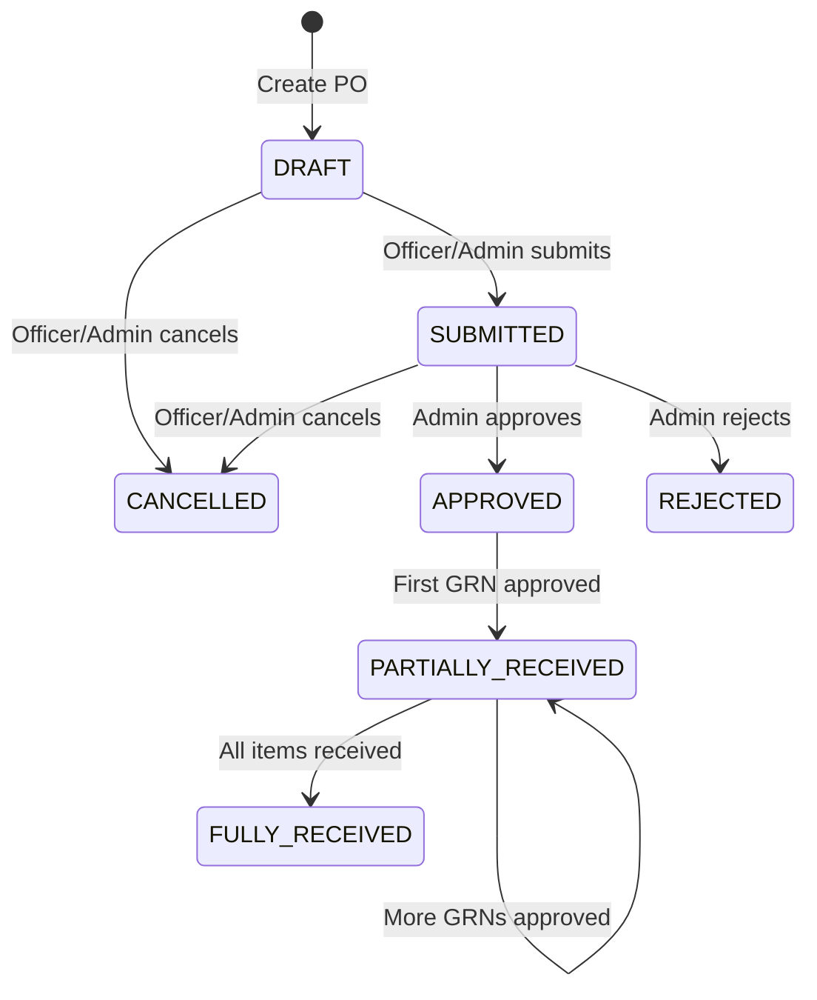
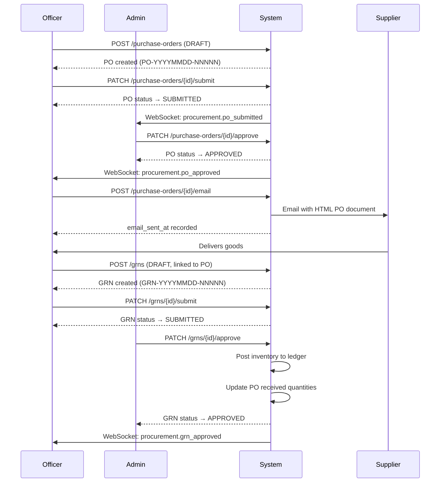

# Purchase Order Workflow

## Status Lifecycle

## State Transition Rules

| From Status    | Action   | To Status    | Who                   | Rule                                    |
|----------------|----------|--------------|-----------------------|-----------------------------------------|
| DRAFT          | Submit   | SUBMITTED    | Officer / Admin       | PO must have at least one item          |
| DRAFT          | Cancel   | CANCELLED    | Officer / Admin       | Any reason required                     |
| SUBMITTED      | Approve  | APPROVED     | Admin                 | —                                       |
| SUBMITTED      | Reject   | REJECTED     | Admin                 | Rejection reason required               |
| SUBMITTED      | Cancel   | CANCELLED    | Officer / Admin       | Any reason required                     |
| APPROVED       | GRN Approved | PARTIALLY_RECEIVED | System       | Triggered when a GRN is approved        |
| PARTIALLY_RECEIVED | GRN Approved | FULLY_RECEIVED | System    | All ordered quantities received         |

## Business Rules

1. **Only DRAFT POs are editable.** Once submitted, the PO content is locked.
2. **Only SUBMITTED POs can be approved or rejected.**
3. **Only APPROVED or PARTIALLY_RECEIVED POs can have GRNs created against them.**
4. **A PO can be duplicated in any status.** The duplicate is always created as DRAFT.
5. **Only APPROVED (or later) POs can be emailed.** The email goes to the supplier's email address by default, but can be overridden.

## Full Workflow Sequence

## Email Template

When a PO is emailed, the system generates a professional HTML document containing:

- Supplier information (name, email, contact person)
- PO number and order date
- Itemised table (product, quantity, unit price, discount, tax, line total)
- Financial summary (subtotal, discount, tax, total)
- Optional custom message
- Notes and terms & conditions

The email is sent via SMTP using the existing `EmailService`.

## Duplicate PO

The `POST /purchase-orders/{id}/duplicate` endpoint:

1. Reads all items from the original PO
2. Creates a new DRAFT PO with today's date
3. Copies all line items (product, quantity, price, discount, tax)
4. Assigns a new PO number
5. Returns the new PO

Useful for recurring orders from the same supplier.
