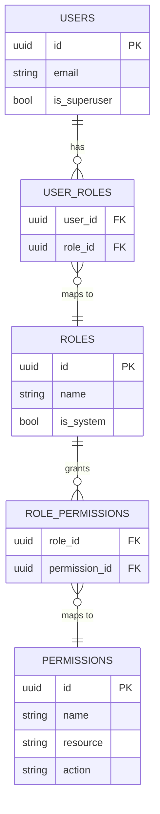
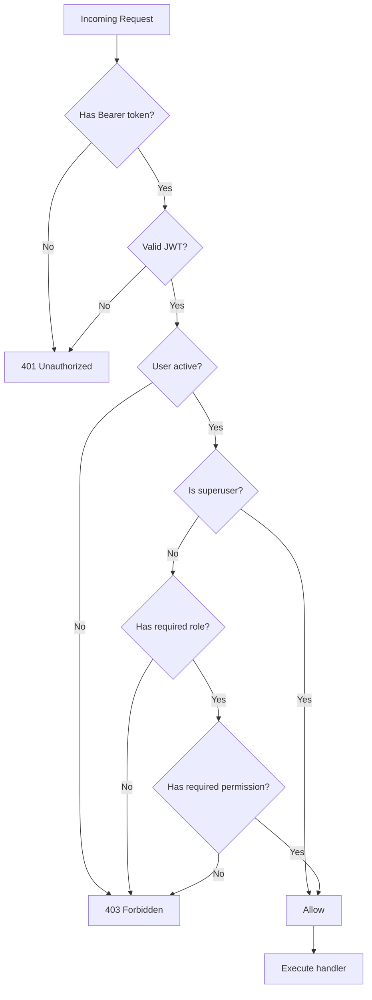

# RBAC — Role-Based Access Control

## Overview

SIMS Lite implements Role-Based Access Control (RBAC) using a **roles → permissions** model. Users have one or more roles; roles grant a set of permissions; permissions define what actions are allowed on which resources.

---

## Data Model



---

## Built-In System Roles

| Role | Description |
|------|-------------|
| `ADMIN` | Full system access — manages users, roles, and all data |
| `OFFICER` | Academic officer — read/write access to academic records and reports |
| `STORE_KEEPER` | Manages inventory and procurement orders |

System roles (`is_system=True`) cannot be deleted via the API.

---

## Permission Naming Convention

Permissions follow the `resource:action` format:

| Permission | Description |
|-----------|-------------|
| `users:read` | View user accounts |
| `users:write` | Create and update users |
| `users:delete` | Delete users |
| `roles:read` | View roles |
| `roles:write` | Create and update roles |
| `roles:delete` | Delete roles |
| `permissions:read` | View permissions |
| `permissions:write` | Create permissions |
| `audit_logs:read` | View audit logs |
| `reports:read` | View reports |
| `reports:export` | Export reports |
| `inventory:read` | View inventory |
| `inventory:write` | Manage inventory |
| `procurement:read` | View procurement orders |
| `procurement:write` | Create procurement orders |

---

## Role-Permission Mapping (Default)

| Permission | ADMIN | OFFICER | STORE_KEEPER |
|-----------|:-----:|:-------:|:------------:|
| `users:read` | ✅ | ✅ | |
| `users:write` | ✅ | | |
| `users:delete` | ✅ | | |
| `roles:read` | ✅ | | |
| `roles:write` | ✅ | | |
| `roles:delete` | ✅ | | |
| `permissions:read` | ✅ | | |
| `permissions:write` | ✅ | | |
| `audit_logs:read` | ✅ | | |
| `reports:read` | ✅ | ✅ | |
| `reports:export` | ✅ | ✅ | |
| `inventory:read` | ✅ | ✅ | ✅ |
| `inventory:write` | ✅ | | ✅ |
| `procurement:read` | ✅ | ✅ | ✅ |
| `procurement:write` | ✅ | ✅ | |

---

## Authorization Request Flow



---

## Using RBAC in Code

### Require Authentication (any active user)

```python
from app.core.deps import get_current_user

@router.get("/data")
async def get_data(user: User = Depends(get_current_user)):
    ...
```

### Require a Role

```python
from app.core.deps import require_roles

@router.get("/admin-only")
async def admin(user: User = Depends(require_roles("ADMIN"))):
    ...

# Multiple allowed roles (OR logic)
@router.get("/reports")
async def reports(user: User = Depends(require_roles("ADMIN", "OFFICER"))):
    ...
```

### Require a Permission

```python
from app.core.deps import require_permission

@router.post("/inventory")
async def update_inventory(user: User = Depends(require_permission("inventory:write"))):
    ...
```

### Superuser Override

Superusers bypass all role and permission checks automatically.

---

## Managing Roles via API

All role management endpoints require the `ADMIN` role.

```bash
# List roles
GET /api/v1/roles/

# Create a role
POST /api/v1/roles/
{ "name": "AUDITOR", "description": "Read-only auditor", "permission_ids": [...] }

# Update a role's permissions
PUT /api/v1/roles/{role_id}
{ "permission_ids": [...] }

# Assign roles to a user
PUT /api/v1/users/{user_id}/roles
{ "role_ids": [...] }
```

---

## Superuser Account

On first startup, a default superuser is created:

| Field | Value |
|-------|-------|
| Email | `admin@sims.local` |
| Password | `Admin@1234!` |

**Change the password immediately after first login in any non-development environment.**
