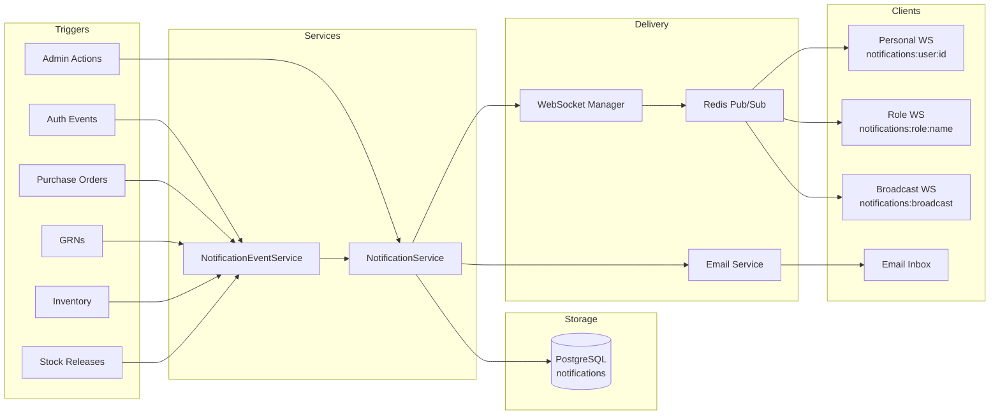
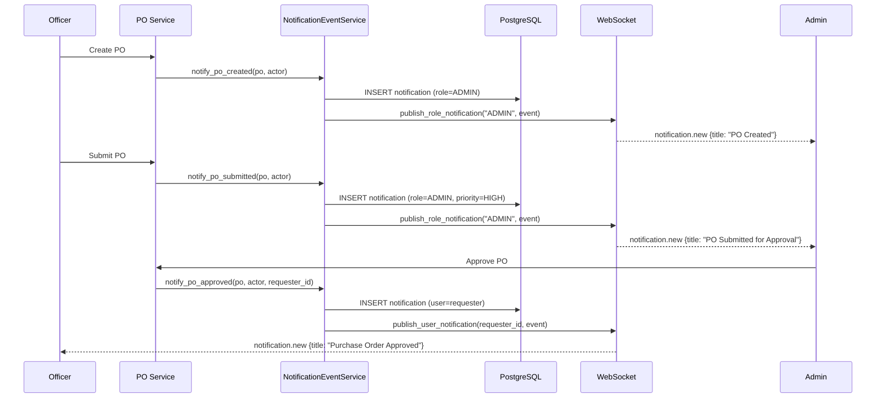
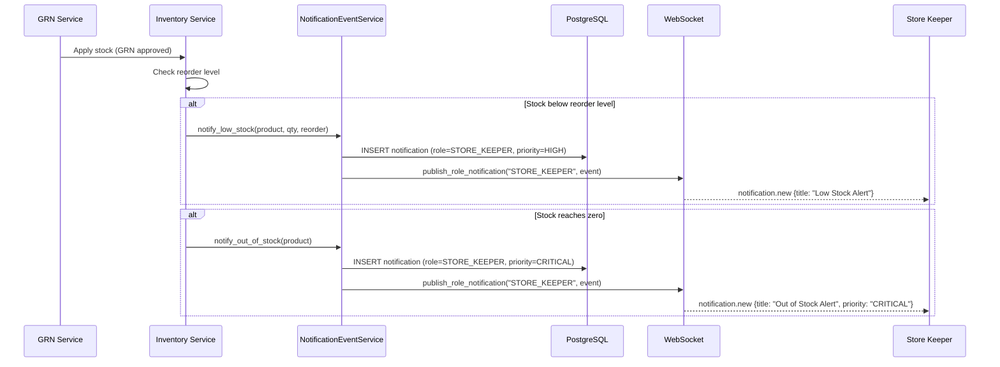

# Real-Time Events — Phase 6A

This document describes all real-time events flowing through the SIMS Lite notification pipeline.

---

## Event Flow Overview



---

## Complete Event Catalogue

### System Events

| WebSocket Event | Trigger | Direction |
|----------------|---------|-----------|
| `system.connected` | Client connects | Server → Client |
| `system.disconnected` | Client disconnects | Server → Client |
| `system.ping` | Keepalive | Client → Server |
| `system.pong` | Ping response | Server → Client |
| `system.error` | Protocol error | Server → Client |
| `system.broadcast` | System-wide message | Server → All |

### Notification Events

| WebSocket Event | Trigger | Recipients |
|----------------|---------|------------|
| `notification.new` | Any notification created | Targeted recipients |
| `notification.read` | User marks read | The user |
| `notification.all_read` | User marks all read | The user |
| `notification.deleted` | User deletes | The user |
| `notification.unread_count` | Count update | The user |
| `notification.broadcast` | Admin broadcast | Everyone |

### Procurement Events (existing Phase 3)

| WebSocket Event | Trigger |
|----------------|---------|
| `procurement.po_created` | PO created |
| `procurement.po_submitted` | PO submitted for approval |
| `procurement.po_approved` | PO approved |
| `procurement.po_rejected` | PO rejected |
| `procurement.po_cancelled` | PO cancelled |
| `procurement.grn_created` | GRN created |
| `procurement.grn_approved` | GRN approved |
| `procurement.grn_cancelled` | GRN cancelled |

### Inventory Events (existing Phase 4)

| WebSocket Event | Trigger |
|----------------|---------|
| `inventory.increased` | Stock quantity increased |
| `inventory.decreased` | Stock quantity decreased |
| `inventory.low_stock` | Stock below reorder level |
| `inventory.out_of_stock` | Stock reaches zero |
| `inventory.adjustment_created` | Stock adjustment created |
| `inventory.adjustment_submitted` | Adjustment submitted |
| `inventory.adjustment_approved` | Adjustment approved |
| `inventory.adjustment_cancelled` | Adjustment cancelled |

### Stock Release Events (existing Phase 5)

| WebSocket Event | Trigger |
|----------------|---------|
| `stock_release.created` | Stock release created |
| `stock_release.submitted` | Release submitted |
| `stock_release.approved` | Release approved |
| `stock_release.cancelled` | Release cancelled |

---

## Auto-Notification Event Flow

### Purchase Order Lifecycle



### Inventory Alert Flow



---

## Redis Pub/Sub Message Format

All Redis messages are JSON-encoded `WebSocketEvent` objects:

```json
{
  "event": "notification.new",
  "payload": {
    "notification": {
      "id": "550e8400-e29b-41d4-a716-446655440000",
      "title": "Purchase Order Approved",
      "message": "Your PO-2026-001 has been approved.",
      "type": "PURCHASE_ORDER",
      "priority": "NORMAL",
      "is_read": false,
      "created_at": "2026-07-24T10:00:00Z"
    }
  },
  "room": null,
  "sender": null
}
```

---

## Error Handling

All `NotificationEventService` methods silently log and swallow exceptions — a notification delivery failure must never interrupt the primary business operation:

```python
try:
    await self._svc.create_role_notification(...)
except Exception as exc:
    logger.warning("Auto-notify po_created failed", error=str(exc))
    # Business operation continues normally
```

---

## Delivery Guarantees

| Channel | Guarantee | Notes |
|---------|-----------|-------|
| PostgreSQL | Persistent | Source of truth for read state |
| WebSocket | Best-effort | Not delivered if client is offline |
| Email | Best-effort | Retry not implemented (Phase 6A) |
| Redis | Best-effort | At-most-once pub/sub |

For offline users, notifications persist in PostgreSQL and are delivered on next login via the WebSocket initial unread count + polling the REST API.
