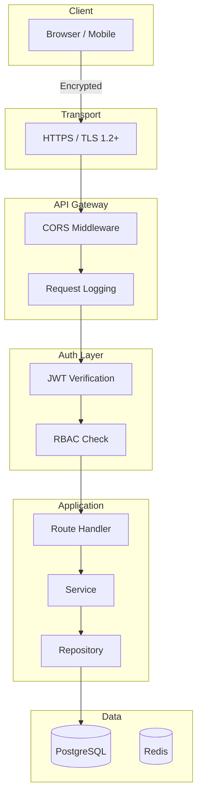

# Security Guide — SIMS Lite Backend

## Security Architecture



---

## Password Security

### Hashing

Passwords are hashed using **bcrypt** (via passlib) with a random salt. Plaintext passwords are never stored or logged.

```python
from app.core.security import hash_password, verify_password

# Hash when creating a user
hashed = hash_password("raw_password")

# Verify on login
is_valid = verify_password("raw_password", hashed)
```

### Password Policy

All passwords must:
- Be at least **8 characters** long
- Contain at least one **uppercase** letter (`A-Z`)
- Contain at least one **lowercase** letter (`a-z`)
- Contain at least one **digit** (`0-9`)
- Contain at least one **special character** (`!@#$%^&*...`)

Enforced at validation time in Pydantic schemas before reaching the service layer.

---

## JWT Security

### Token Types

| Type | TTL | Storage Recommendation |
|------|-----|------------------------|
| Access token | 30 min | In-memory (JS variable) |
| Refresh token | 7 days | HttpOnly cookie or secure storage |

### Signing

- Algorithm: **HS256** (HMAC-SHA256)
- Secret key: configured via `JWT_SECRET_KEY` environment variable
- Minimum recommended key length: **32 random bytes** (256 bits)

Generate a secure key:
```bash
python -c "import secrets; print(secrets.token_hex(32))"
```

### Token Claims Validation

Every request validates:
1. JWT signature is valid
2. Token is not expired (`exp` claim)
3. Token type is `access` (not `refresh`)
4. User exists in the database
5. User account is active

### Refresh Token Rotation

- Each refresh token is stored as a **SHA-256 hash** in the database
- On use, the old token is immediately revoked
- A new token pair is issued
- Re-use of a revoked token returns 401 (potential token theft indicator)

---

## Brute-Force Protection

### Account Locking

| Setting | Value |
|---------|-------|
| Max failed attempts | 5 |
| Lock duration | 15 minutes |
| Lock storage | `users.locked_until` (database) |

After `MAX_FAILED_ATTEMPTS` consecutive failures:
1. The account's `locked_until` is set to `now() + 15 minutes`
2. Subsequent login attempts return 403 with remaining lock time

### User Enumeration Prevention

- `/forgot-password` always returns 200 regardless of whether the email exists
- Login errors use the same generic message for unknown email and wrong password

---

## Audit Logging

All security-sensitive operations are logged to the `audit_logs` table:

| Action | Description |
|--------|-------------|
| `auth.register` | New account created |
| `auth.login` | Login attempt (success or failure) |
| `auth.logout` | Single-device logout |
| `auth.logout_all` | All-device logout |
| `auth.token_refresh` | Refresh token rotation |
| `auth.forgot_password` | Password reset requested |
| `auth.reset_password` | Password reset completed |
| `auth.change_password` | Authenticated password change |
| `auth.verify_email` | Email verified |
| `user.create` | User created by admin |
| `user.update` | User record updated |
| `user.activate` | User activated |
| `user.deactivate` | User deactivated |
| `user.delete` | User permanently deleted |
| `user.roles_assign` | Roles assigned to user |
| `role.create` | New role created |
| `role.update` | Role updated |
| `role.delete` | Role deleted |
| `permission.create` | New permission created |
| `permission.delete` | Permission deleted |

Each entry records: actor ID, IP address, user agent, resource type/ID, status, and detail JSON.

---

## CORS

Allowed origins are configured via `CORS_ORIGINS` environment variable (JSON array):

```env
CORS_ORIGINS=["http://localhost:3000", "https://yourdomain.com"]
```

In production, never use `["*"]` — always list explicit origins.

---

## Input Validation

All user input is validated by Pydantic v2 schemas before reaching service logic:
- Email addresses are validated with `email-validator`
- String lengths are bounded
- Enum values are enforced
- UUIDs are type-checked

Validation errors return HTTP 422 with detailed field-level error messages.

---

## Production Security Checklist

Before deploying to production:

- [ ] Set `APP_ENV=production`
- [ ] Set `APP_DEBUG=false`
- [ ] Replace `JWT_SECRET_KEY` with a strong random secret (`>= 32 bytes`)
- [ ] Replace `APP_SECRET_KEY` with a strong random secret
- [ ] Configure `CORS_ORIGINS` with only your frontend domains
- [ ] Configure SMTP for password reset emails
- [ ] Change the default superuser password (`admin@sims.local`)
- [ ] Enable PostgreSQL SSL (`?sslmode=require`)
- [ ] Put the API behind HTTPS (Nginx/ALB)
- [ ] Set up rate limiting at the proxy level
- [ ] Enable Redis TLS/AUTH for token storage
- [ ] Rotate secrets at least every 90 days

---

## Secrets Management

Never commit secrets to source control. Use one of:
- Environment variables via `.env` (development only)
- AWS Secrets Manager / Parameter Store (production)
- HashiCorp Vault (production)
- Docker/Kubernetes Secrets (container deployments)

The `.gitignore` already excludes `.env`.

---

## Dependency Security

Pin all dependencies to exact versions (already done in `requirements.txt`). Run:

```bash
pip audit
# or
safety check -r requirements.txt
```

to scan for known CVEs on a regular basis.
