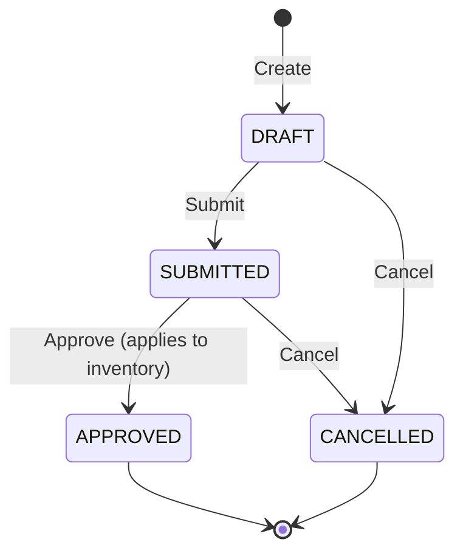

# Stock Adjustments

## Overview

Stock Adjustments allow authorised users to manually correct inventory levels. Common reasons include:

- Discrepancies found during a physical stock count
- Damaged or spoiled goods that must be written off
- Stock found that was previously unaccounted for
- Theft or shrinkage corrections

Adjustments follow a controlled approval workflow to ensure changes to inventory are reviewed before being applied.

## Adjustment Types

| Type | Description | Effect on Stock |
|---|---|---|
| `INCREASE` | Found stock, damage reversal, or any positive correction | Adds quantity to `quantity_on_hand` |
| `DECREASE` | Damaged goods, theft, shrinkage, or any negative correction | Removes quantity from `quantity_on_hand` |
| `RECOUNT` | Physical count correction — sets stock to a new counted value | Can be positive or negative depending on the difference |

## Workflow



1. A user creates a DRAFT adjustment and adds line items.
2. When ready, the user submits the adjustment (DRAFT → SUBMITTED).
3. An authorised approver reviews and approves it (SUBMITTED → APPROVED). Approval immediately applies all quantity changes to inventory and writes immutable ledger entries.
4. Either a DRAFT or SUBMITTED adjustment can be cancelled at any time before approval.
5. APPROVED adjustments are terminal — they cannot be reversed via the UI (a correcting adjustment must be created instead).

## API Reference

| Method | Path | Permission | Description |
|---|---|---|---|
| `GET` | `/api/v1/stock-adjustments/` | `inventory:read` | Paginated list of adjustments with optional filters |
| `POST` | `/api/v1/stock-adjustments/` | `inventory:write` | Create a new DRAFT adjustment |
| `GET` | `/api/v1/stock-adjustments/{id}` | `inventory:read` | Get a single adjustment by ID |
| `PUT` | `/api/v1/stock-adjustments/{id}` | `inventory:write` | Update a DRAFT adjustment (header and/or items) |
| `DELETE` | `/api/v1/stock-adjustments/{id}` | `inventory:write` | Soft-delete a DRAFT adjustment |
| `PATCH` | `/api/v1/stock-adjustments/{id}/submit` | `inventory:write` | Submit adjustment for approval |
| `PATCH` | `/api/v1/stock-adjustments/{id}/approve` | `inventory:write` | Approve and apply to inventory |
| `PATCH` | `/api/v1/stock-adjustments/{id}/cancel` | `inventory:write` | Cancel with a required reason |

## Permissions

| Permission | Grants Access To |
|---|---|
| `inventory:read` | View adjustments (list and detail) |
| `inventory:write` | Create, update, submit, approve, and cancel adjustments |

Superusers implicitly have all permissions.

## RECOUNT Logic

When the adjustment type is `RECOUNT`, the system calculates the required change by comparing the submitted count against the current stock:

```
quantity_change = new_count - current_stock
```

- If the result is **positive**, the ledger entry type is `ADJUSTMENT_IN` (stock was higher than recorded).
- If the result is **negative**, the ledger entry type is `ADJUSTMENT_OUT` (stock was lower than recorded).
- If the result is **zero**, no ledger entry is written for that item.

The `quantity_adjusted` field on each item always holds the new target count (not the delta).

## Validation Rules

- Only DRAFT adjustments can be edited or deleted; attempting to modify a SUBMITTED or APPROVED adjustment raises a 422 error.
- An adjustment cannot be submitted if it has no line items.
- Each product may appear only once per adjustment — duplicate products in the items list are rejected at creation/update time.
- Stock cannot go below zero: if a DECREASE or RECOUNT adjustment would result in negative `quantity_on_hand`, the approval is rejected with a validation error specifying the affected product.
