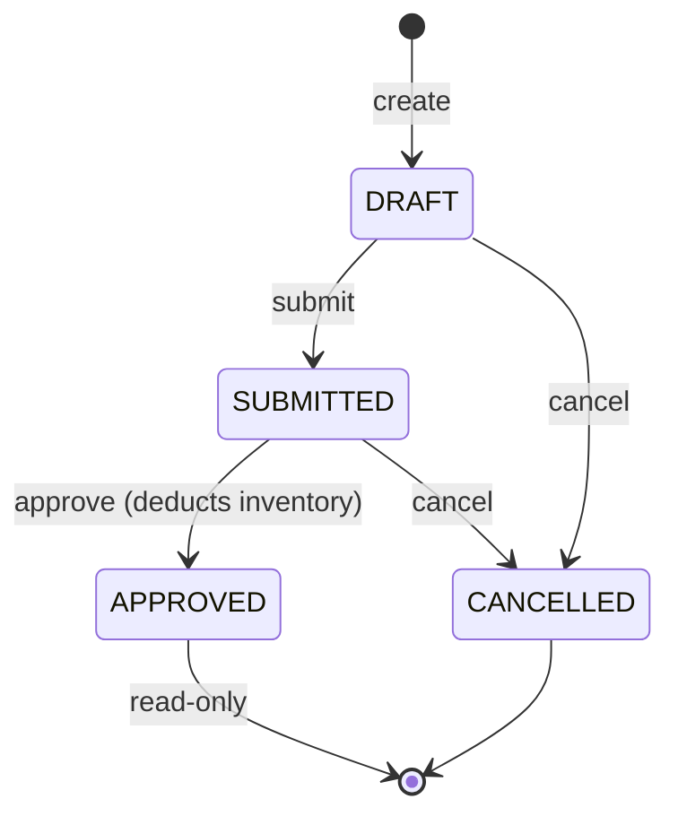

# Stock Release

## Overview

The Stock Release module handles issuing inventory items from the single warehouse location. A Stock Release document records what was taken, why, when, and by whom — and ensures that inventory is only deducted after formal approval.

---

## Document Lifecycle



| Status | Editable | Inventory Impact |
|--------|----------|-----------------|
| DRAFT | ✅ Yes | None |
| SUBMITTED | ❌ No | None |
| APPROVED | ❌ No | ✅ Deducted |
| CANCELLED | ❌ No | None |

---

## Business Rules

- Only **DRAFT** documents can be edited or deleted.
- Only **SUBMITTED** documents can be approved.
- Inventory is **never** deducted before approval.
- Inventory can **never** go below zero — approval will fail with a 422 if any item would cause negative stock.
- **Approved** documents are permanently read-only.
- **Cancelled** documents have zero inventory impact.
- Every approval creates one **immutable `InventoryLedgerEntry`** per line item (`entry_type = STOCK_RELEASE`).
- The unit cost on each release item is captured from `inventory.average_cost` **at the time of approval** (not at creation time).

---

## Release Purposes

| Value | Description |
|-------|-------------|
| `INTERNAL_USE` | General internal consumption |
| `PRODUCTION` | Used in manufacturing / production |
| `MAINTENANCE` | Maintenance and repairs |
| `SALES` | Direct sales fulfilment |
| `SAMPLE` | Samples for testing or marketing |
| `DISPOSAL` | Disposal of damaged / expired items |
| `OTHER` | Any other reason |

---

## API Reference

All endpoints require a valid JWT (`Authorization: Bearer <token>`).

### Stock Release CRUD

| Method | Path | Permission | Description |
|--------|------|------------|-------------|
| `GET` | `/api/v1/stock-releases/` | `inventory:read` | Paginated list with filters |
| `POST` | `/api/v1/stock-releases/` | `inventory:write` | Create DRAFT release |
| `GET` | `/api/v1/stock-releases/{id}` | `inventory:read` | Get single release |
| `PUT` | `/api/v1/stock-releases/{id}` | `inventory:write` | Update (DRAFT only) |
| `DELETE` | `/api/v1/stock-releases/{id}` | `inventory:write` | Soft-delete (DRAFT only) |

### Workflow Transitions

| Method | Path | Permission | Description |
|--------|------|------------|-------------|
| `PATCH` | `/api/v1/stock-releases/{id}/submit` | `inventory:write` | Submit for approval |
| `PATCH` | `/api/v1/stock-releases/{id}/approve` | `inventory:approve` | Approve & deduct inventory |
| `PATCH` | `/api/v1/stock-releases/{id}/cancel` | `inventory:write` | Cancel (no inventory impact) |

### Query Parameters (GET list)

| Parameter | Type | Description |
|-----------|------|-------------|
| `page` | int | Page number (default: 1) |
| `size` | int | Items per page (default: 20, max: 200) |
| `search` | string | Filter by release number |
| `status` | string | Filter by status (DRAFT, SUBMITTED, APPROVED, CANCELLED) |
| `purpose` | string | Filter by purpose |
| `from_date` | datetime | Filter releases on or after this date |
| `to_date` | datetime | Filter releases on or before this date |

---

## Request & Response Shapes

### Create Request

```json
{
  "purpose": "INTERNAL_USE",
  "release_date": "2026-07-23T09:00:00Z",
  "reference_document": "WO-2026-0042",
  "notes": "Weekly maintenance supplies",
  "items": [
    {
      "product_id": "uuid",
      "quantity_requested": 5.0,
      "notes": "For pump unit #3"
    }
  ]
}
```

> Duplicate `product_id` values within `items` are rejected with 422.

### Release Response

```json
{
  "status": "success",
  "data": {
    "id": "uuid",
    "release_number": "SR-20260723-00001",
    "purpose": "INTERNAL_USE",
    "status": "DRAFT",
    "release_date": "2026-07-23T09:00:00Z",
    "reference_document": "WO-2026-0042",
    "notes": "Weekly maintenance supplies",
    "total_quantity": 0.0,
    "total_cost": 0.0,
    "items": [
      {
        "id": "uuid",
        "stock_release_id": "uuid",
        "product": {
          "id": "uuid",
          "sku": "MNT-001",
          "name": "Oil Filter",
          "barcode": "...",
          "reorder_level": 10,
          "cost_price": 12.50,
          "selling_price": 18.00
        },
        "quantity_requested": 5.0,
        "unit_cost": 0.0,
        "line_total": 0.0,
        "notes": "For pump unit #3",
        "created_at": "...",
        "updated_at": "..."
      }
    ],
    "created_by": { "id": "uuid", "first_name": "Jane", ... },
    "submitted_by": null,
    "submitted_at": null,
    "approved_by": null,
    "approved_at": null,
    "cancelled_by": null,
    "cancelled_at": null,
    "cancellation_reason": null,
    "created_at": "...",
    "updated_at": "..."
  }
}
```

> After approval, `unit_cost` and `line_total` are populated from the inventory weighted average cost. `total_quantity` and `total_cost` are updated on the header.

### Cancel Request

```json
{ "reason": "Work order cancelled by supervisor" }
```

---

## Dashboard Widgets

Three new dashboard endpoints are available:

### `GET /api/v1/dashboard/stock-releases`

Returns stock-release-specific KPIs:

```json
{
  "todays_releases": 3,
  "todays_released_quantity": 45.0,
  "monthly_released_quantity": 320.0,
  "pending_releases": 2,
  "recent_releases": [ ... ],
  "top_released_products": [
    { "product_id": "uuid", "total_quantity": 120.0, "total_value": 1500.0 }
  ]
}
```

### `GET /api/v1/dashboard/inventory/extended`

Returns the full combined dashboard — all Phase 4 inventory KPIs plus the Phase 5 stock release widgets in a single response.

---

## Reports

### Stock Release Report — `GET /api/v1/stock-release-reports/releases`

Excel export with two sheets:

- **Stock Releases** — one row per document (header summary)
- **Release Items** — one row per line item

Query parameters: `status`, `purpose`, `from_date`, `to_date`

### Product Consumption Report — `GET /api/v1/stock-release-reports/consumption`

Excel export showing how much of each product has been consumed across approved releases:

- **Product Consumption** — aggregated per-product totals
- **Detail** — every individual release line

Query parameters: `product_id`, `purpose`, `from_date`, `to_date`

Both reports require `reports:export` permission.

---

## Inventory Ledger Integration

Every approved stock release creates one `InventoryLedgerEntry` per item with:

| Field | Value |
|-------|-------|
| `entry_type` | `STOCK_RELEASE` |
| `reference_type` | `STOCK_RELEASE` |
| `reference_id` | Stock Release UUID |
| `reference_number` | e.g. `SR-20260723-00001` |
| `quantity_change` | Negative (deduction) |
| `unit_cost` | WAC at time of approval |

Entries are **immutable** — they are never updated or deleted.

Ledger history for a release can be queried at:

```
GET /api/v1/inventory-ledger/reference/STOCK_RELEASE/{release_id}
```

---

## WebSocket Notifications

Real-time events published on approval/status changes:

| Event | When |
|-------|------|
| `stock_release.created` | DRAFT created |
| `stock_release.submitted` | Submitted for approval |
| `stock_release.approved` | Approved and inventory deducted |
| `stock_release.cancelled` | Cancelled |
| `inventory.decreased` | Per-product inventory deduction (one per item) |
| `inventory.low_stock` | Triggered if stock drops to or below reorder level |
| `inventory.out_of_stock` | Triggered if stock reaches zero |

---

## Database Schema

### `stock_releases`

| Column | Type | Notes |
|--------|------|-------|
| `id` | UUID PK | |
| `release_number` | VARCHAR(30) UNIQUE | e.g. `SR-20260723-00001` |
| `purpose` | VARCHAR(30) | `StockReleasePurpose` enum |
| `status` | VARCHAR(20) | `StockReleaseStatus` enum |
| `release_date` | TIMESTAMPTZ | |
| `notes` | TEXT | |
| `reference_document` | VARCHAR(100) | External document ref |
| `total_quantity` | NUMERIC(14,4) | Computed on approval |
| `total_cost` | NUMERIC(14,4) | Computed on approval |
| `created_by_id` | UUID FK→users | |
| `submitted_by_id` | UUID FK→users | |
| `submitted_at` | TIMESTAMPTZ | |
| `approved_by_id` | UUID FK→users | |
| `approved_at` | TIMESTAMPTZ | |
| `cancelled_by_id` | UUID FK→users | |
| `cancelled_at` | TIMESTAMPTZ | |
| `cancellation_reason` | TEXT | |
| `is_deleted` | BOOLEAN | Soft delete |
| `deleted_at` | TIMESTAMPTZ | |
| `created_at` | TIMESTAMPTZ | |
| `updated_at` | TIMESTAMPTZ | |

### `stock_release_items`

| Column | Type | Notes |
|--------|------|-------|
| `id` | UUID PK | |
| `stock_release_id` | UUID FK→stock_releases CASCADE | |
| `product_id` | UUID FK→products RESTRICT | |
| `quantity_requested` | NUMERIC(12,4) | Always positive |
| `unit_cost` | NUMERIC(12,4) | Set from WAC at approval |
| `line_total` | NUMERIC(14,4) | `quantity_requested × unit_cost` |
| `notes` | TEXT | |
| `created_at` | TIMESTAMPTZ | |
| `updated_at` | TIMESTAMPTZ | |
