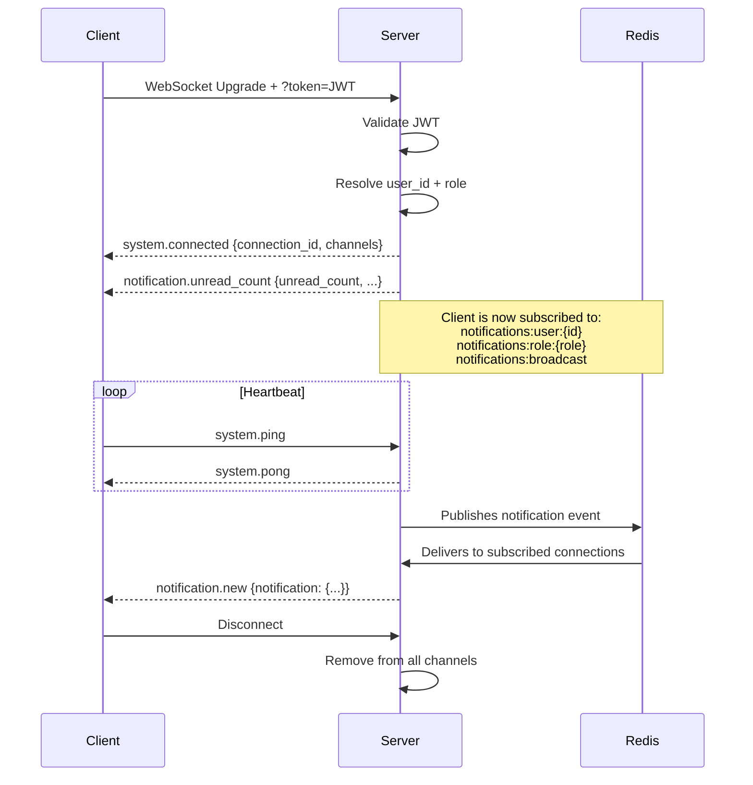
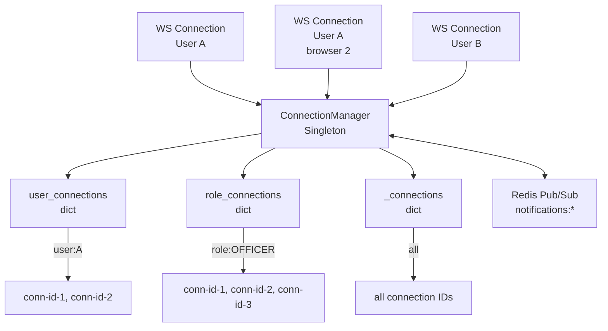

# WebSocket System — Phase 6A

SIMS Lite exposes two WebSocket endpoints for real-time communication.

---

## Endpoints

| Path | Auth | Purpose |
|------|------|---------|
| `/api/v1/ws/connect` | Optional | Generic room-based channel |
| `/api/v1/ws/notifications` | Required (JWT) | Authenticated notification delivery |

---

## Notification WebSocket

### Connection

Connect to `/api/v1/ws/notifications?token=<access_token>`.

The JWT access token is passed as a query parameter because browser `WebSocket` implementations do not support custom headers during the HTTP upgrade handshake.

```javascript
const token = localStorage.getItem('access_token');
const ws = new WebSocket(`wss://api.example.com/api/v1/ws/notifications?token=${token}`);
```

### Connection Lifecycle



### On Connect Response

```json
{
  "event": "system.connected",
  "payload": {
    "connection_id": "550e8400-e29b-41d4-a716-446655440000",
    "user_id": "123e4567-e89b-12d3-a456-426614174000",
    "role": "OFFICER",
    "channels": [
      "notifications:user:123e4567-e89b-12d3-a456-426614174000",
      "notifications:role:OFFICER",
      "notifications:broadcast"
    ]
  }
}
```

### Initial Unread Count

Immediately after the connection event the server sends the current unread count:

```json
{
  "event": "notification.unread_count",
  "payload": {
    "unread_count": 5,
    "critical_count": 1,
    "high_count": 2
  }
}
```

---

## Client Messages

| Event | Direction | Description |
|-------|-----------|-------------|
| `system.ping` | Client → Server | Keepalive |
| `notification.unread_count` | Client → Server | Request fresh unread count |

### Ping/Pong

```javascript
// Send ping every 30 seconds
setInterval(() => ws.send(JSON.stringify({ event: 'system.ping' })), 30000);

ws.onmessage = (msg) => {
  const data = JSON.parse(msg.data);
  if (data.event === 'system.pong') {
    // Connection alive
  }
};
```

---

## Server Events

| Event | Description |
|-------|-------------|
| `system.connected` | Connection established |
| `system.pong` | Response to ping |
| `system.error` | Protocol or auth error |
| `notification.new` | New notification delivered |
| `notification.read` | Notification marked read |
| `notification.all_read` | All notifications marked read |
| `notification.deleted` | Notification deleted |
| `notification.unread_count` | Fresh unread count |
| `notification.broadcast` | Admin broadcast |

### `notification.new` Payload

```json
{
  "event": "notification.new",
  "payload": {
    "notification": {
      "id": "uuid",
      "title": "Purchase Order Approved",
      "message": "Your PO-2026-001 has been approved.",
      "type": "PURCHASE_ORDER",
      "priority": "NORMAL",
      "is_read": false,
      "created_at": "2026-07-24T10:00:00Z"
    }
  }
}
```

---

## Reconnect Strategy

Clients should implement exponential back-off on disconnect:

```javascript
class NotificationWebSocket {
  constructor(token) {
    this.token = token;
    this.retryDelay = 1000;
    this.maxRetryDelay = 30000;
    this.connect();
  }

  connect() {
    this.ws = new WebSocket(
      `wss://api.example.com/api/v1/ws/notifications?token=${this.token}`
    );

    this.ws.onopen = () => {
      this.retryDelay = 1000; // reset on success
    };

    this.ws.onclose = (event) => {
      if (event.code === 4001) {
        // Auth error — don't reconnect, refresh token first
        return;
      }
      setTimeout(() => this.connect(), this.retryDelay);
      this.retryDelay = Math.min(this.retryDelay * 2, this.maxRetryDelay);
    };

    this.ws.onmessage = (msg) => {
      const data = JSON.parse(msg.data);
      this.handleEvent(data);
    };
  }

  handleEvent(data) {
    switch (data.event) {
      case 'notification.new':
        this.onNewNotification(data.payload.notification);
        break;
      case 'notification.unread_count':
        this.onUnreadCount(data.payload);
        break;
    }
  }
}
```

---

## Connection Manager Architecture



The manager tracks connections by three indices simultaneously:
- `connection_id → WebSocket` — all active connections
- `user_id → {connection_ids}` — personal channels (a user may have multiple tabs open)
- `role → {connection_ids}` — role-based channels

---

## Redis Pub/Sub Channels

| Channel Pattern | Audience |
|----------------|----------|
| `notifications:user:<uuid>` | Single user (all their connections) |
| `notifications:role:<name>` | All connected users with that role |
| `notifications:broadcast` | Every connected client |

The Redis pub/sub bridge enables horizontal scaling across multiple API workers. Each worker subscribes to `notifications:*` and forwards matching messages to locally-connected clients.

---

## Generic WebSocket

The legacy `/api/v1/ws/connect` endpoint supports unauthenticated room-based channels for future use:

```javascript
const ws = new WebSocket('wss://api.example.com/api/v1/ws/connect?room=general');
```

Supported client events: `system.ping` → responds with `system.pong`.
